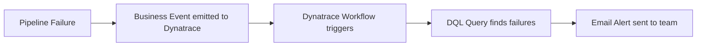
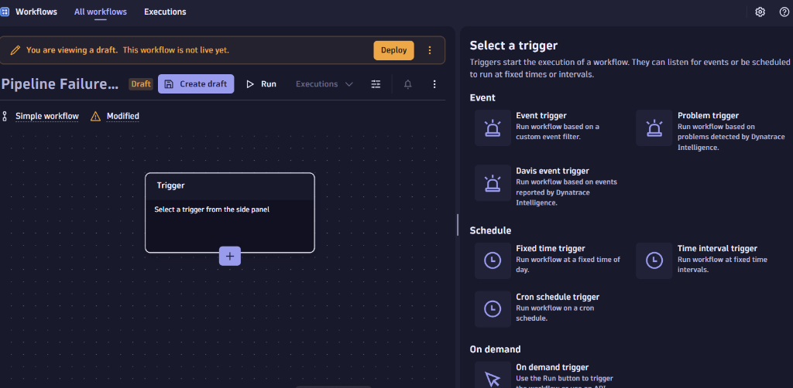
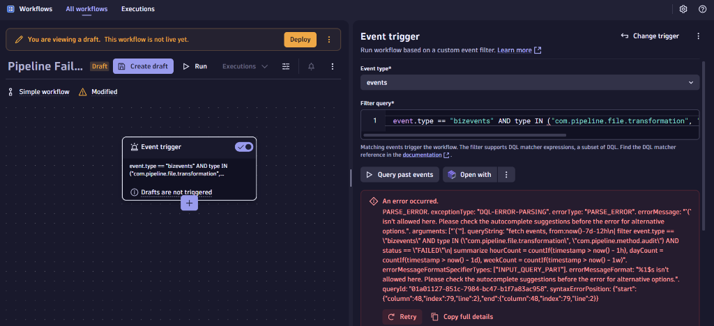
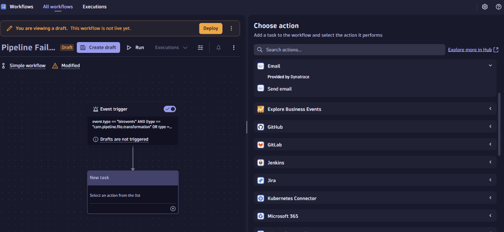
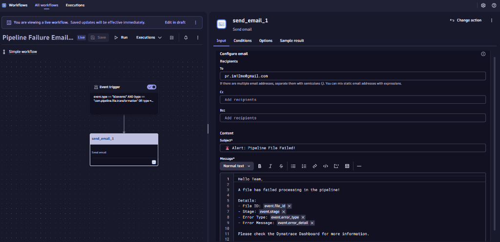
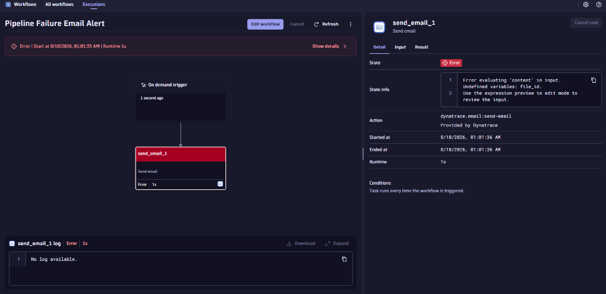
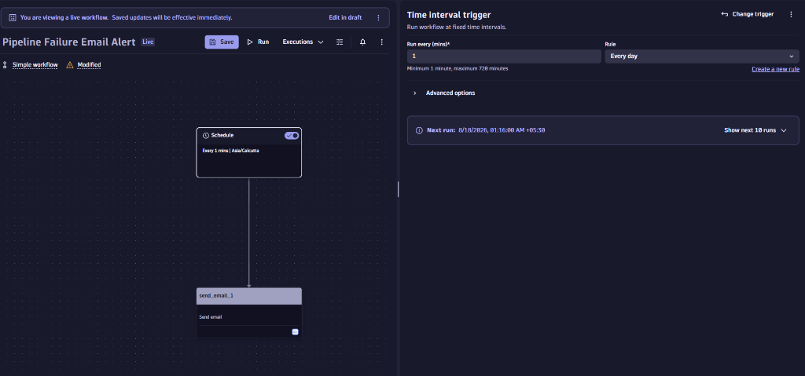
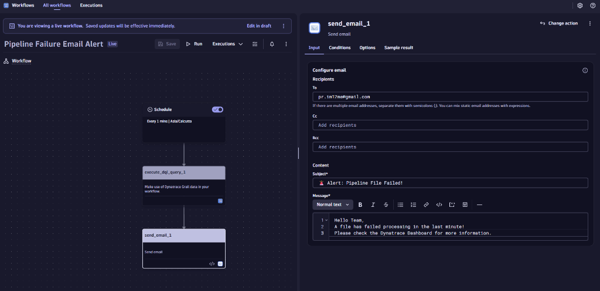
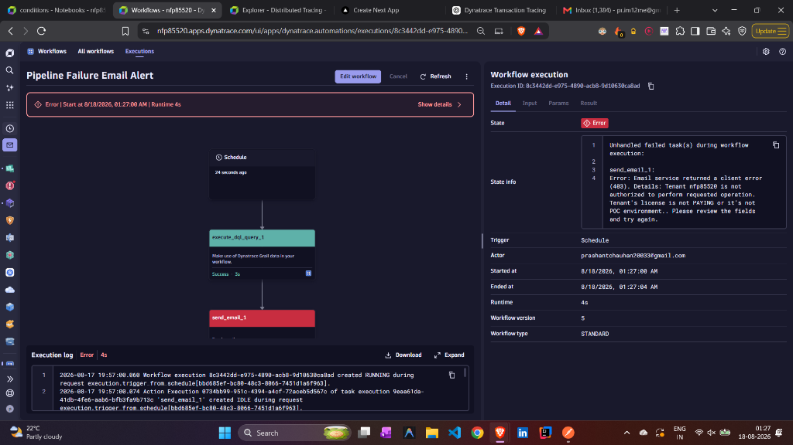
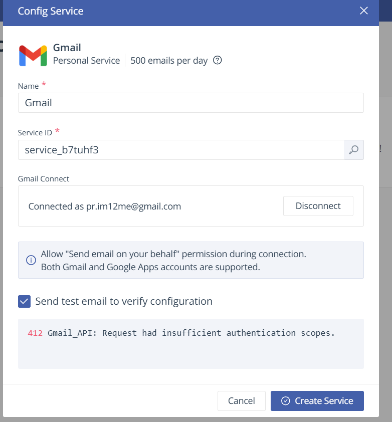

# Dynatrace Alert Triggering — Email Alerts on Pipeline Failure

This document covers how to set up automated email alerts in Dynatrace using **Workflows**, so that your team is instantly notified whenever a file fails in the processing pipeline.

---

## 1. The Goal

When a file fails at any stage (S1 Ingestion, S2 Transformation, or S3 Persistence), Dynatrace should automatically detect the failure and send an email alert with the details.

### Architecture Flow:


---

## 2. Creating the Workflow

### Step 1: Open Workflows
1. In Dynatrace, search for **Workflows** in the left-hand menu.
2. Click **Create Workflow**.
3. Name it **"Pipeline Failure Email Alert"**.

### Step 2: Select a Trigger
You are presented with a list of trigger types. The trigger determines *when* the workflow runs.



There are two main approaches:

| Trigger Type | How it works | Best for |
|---|---|---|
| **Event trigger** | Fires instantly when a matching Business Event arrives | Real-time alerts |
| **Time interval trigger** | Runs on a schedule (e.g., every 1 minute) | Batch-checking for failures |

---

## 3. Approach 1: Event Trigger (Real-Time)

The Event trigger listens for specific Business Events in real-time.

### Configuration:
1. Select **Event trigger** from the trigger list.
2. Set the **Event type** to `events`.
3. In the **Filter query** box, paste:
   ```dql
   event.type == "bizevents" AND (type == "com.pipeline.file.transformation" OR type == "com.pipeline.method.audit") AND status == "FAILED"
   ```

> **⚠️ Important:** The Event trigger filter uses a **subset of DQL** (called DQL matcher expressions). Full DQL commands like `fetch` are NOT allowed here. Only simple equality/comparison filters work.



*The screenshot above shows what happens if you paste a full `fetch` DQL command into the Event trigger — it will throw a parsing error.*

### Adding the Email Action:
1. Click the **`+`** button under the trigger.
2. You will see the action list. Select **Send email** (under "Email - Provided by Dynatrace").



### Configuring the Email:
Fill in the email configuration:
- **To:** Your email address
- **Subject:** `🚨 Alert: Pipeline File Failed!`
- **Message Body:** Use `{{ event() }}` expressions to inject the actual failure data:

```text
Hello Team,

A file has failed processing in the pipeline!

Details:
- File ID: {{ event()["file_id"] }}
- Stage: {{ event()["stage"] }}
- Error Type: {{ event()["error_type"] }}
- Error Message: {{ event()["error_detail"] }}

Please check the Dynatrace Dashboard for more information.
```



### Common Pitfall — Manual "Run" Button:
If you click the **Run** button in the Dynatrace UI to test this workflow, it will **crash** with `Undefined variables: file_id`. This is because the manual "Run" button does not attach any event data — it runs the workflow with an empty context.



**The only way to test an Event trigger** is to actually send a failing file through the pipeline and let the event arrive naturally.

---

## 4. Approach 2: Scheduled Trigger (Recommended for POC)

The scheduled approach is more reliable for a POC because it uses a full DQL query to search for failures in the past N minutes.

### Step 1: Configure the Schedule
1. Select **Time interval trigger**.
2. Set **Run every** to `1` minute.



### Step 2: Add a DQL Query Action
1. Click the `+` button between the Schedule and the Email action.
2. Add **Execute DQL Query**.
3. Paste this exact query:

```dql
fetch bizevents, from: now() - 1m
| filter (type == "com.pipeline.file.transformation" or type == "com.pipeline.method.audit") and status == "FAILED"
```

This query searches the Dynatrace Data Lake (Grail) for any Business Events with `status == "FAILED"` that were emitted in the last 1 minute.

### Step 3: Configure the Email
Click on the email action and set up the body with a simple message:

```text
Hello Team,
A file has failed processing in the last minute!
Please check the Dynatrace Dashboard for more information.
```

### The Complete Workflow:
The final workflow looks like this:



**Flow:** Schedule (every 1 min) → DQL Query (find failures) → Send Email (alert team)

---

## 5. Free Trial Limitation — Email Service

> **⚠️ Important Discovery:** Dynatrace's built-in **Send Email** action requires a **paid license**. On a free trial, it returns a `403 Forbidden` error:



The error message reads:
```
Error: Email service returned a client error (403).
Details: Tenant nfp85520 is not authorized to perform requested operation.
Tenant's license is not PAYING or it's not POC environment.
```

### Workaround: Use EmailJS (Free External Email API)

Instead of Dynatrace's locked email action, we use **EmailJS** — a free service that provides a REST API for sending emails (200 emails/month on the free tier).

#### Setting up EmailJS:

1. Go to [https://www.emailjs.com](https://www.emailjs.com) and create a free account.
2. **Add an Email Service:** Go to Email Services → Add New Service → Select Gmail → Connect your Gmail account.



3. **Create an Email Template:** Go to Email Templates → Create New Template:
   - **Subject:** `🚨 Alert: Pipeline File Failed!`
   - **Body:**
     ```
     Hello Team,

     A file has failed processing in the pipeline!

     {{message}}

     Please check the Dynatrace Dashboard for more information.
     ```
   - **To Email:** `{{to_email}}`

4. **Get your API keys:** Go to Account → API Keys → Copy your **Public Key**.

#### Replacing Send Email with HTTP Request in Dynatrace:

1. In the Dynatrace Workflow, delete the `send_email_1` action.
2. Add a new action: **HTTP Request** (or "Send HTTP request").
3. Configure it:
   - **Method:** `POST`
   - **URL:** `https://api.emailjs.com/api/v1.0/email/send`
   - **Headers:** `Content-Type: application/json`
   - **Body:**
     ```json
     {
       "service_id": "YOUR_SERVICE_ID",
       "template_id": "YOUR_TEMPLATE_ID",
       "user_id": "YOUR_PUBLIC_KEY",
       "template_params": {
         "to_email": "your-email@gmail.com",
         "message": "A pipeline failure was detected in the last minute! Please check the Dynatrace Dashboard immediately."
       }
     }
     ```

4. Click **Save** → **Deploy**.

---

## 6. Testing the Alert

To test the alert end-to-end:

1. Send a corrupted file through the pipeline (e.g., a file with a missing "Title" section):
   ```bash
   curl -X POST http://localhost:8081/api/files/upload -F "file=@sample-files/error_missing_title.txt"
   ```

2. The Spring Boot service (S2) will reject the file and emit a `status: FAILED` Business Event to Dynatrace.

3. The Dynatrace Workflow will either:
   - **Event trigger:** Fire instantly when the event arrives.
   - **Schedule trigger:** Pick it up on the next 1-minute cycle.

4. The HTTP Request action calls the EmailJS API, which sends the alert email to your inbox.

---

## 7. Summary

| Component | Purpose |
|---|---|
| **Business Events** | Custom Java code (`BusinessEventEmitter.java`) emits `FAILED` events to Dynatrace |
| **Dynatrace Workflow** | Automates the detection and response to failures |
| **DQL Query** | Searches Grail for `status == "FAILED"` events in the last minute |
| **EmailJS** | Free external service that sends the actual email (workaround for free trial limitation) |

> **For Production:** On a paid Dynatrace license, you would use the built-in **Send Email** action directly (no need for EmailJS). You would also use the **Event trigger** for instant, real-time alerts instead of polling every minute.
