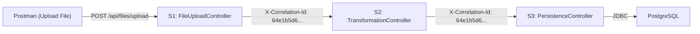
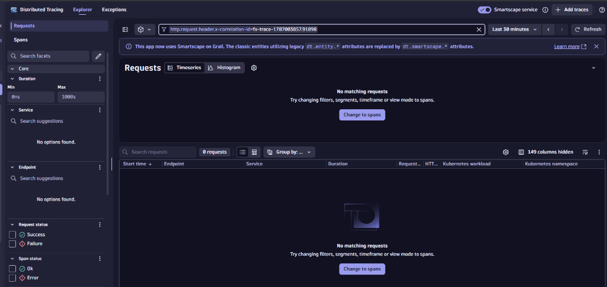
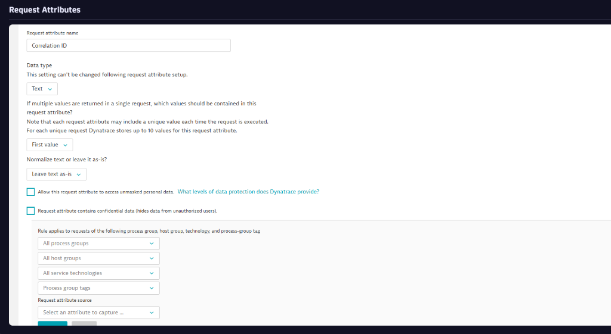
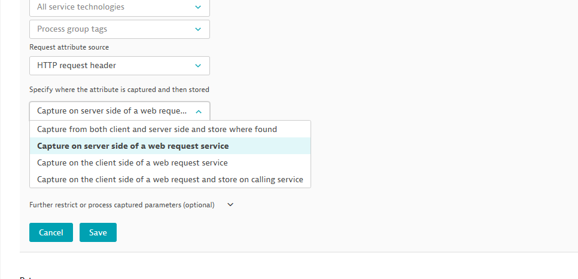
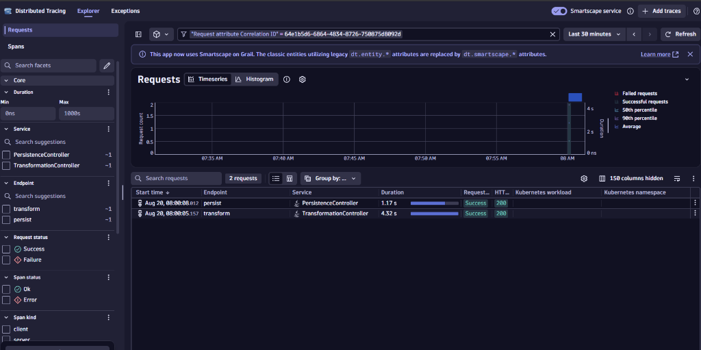
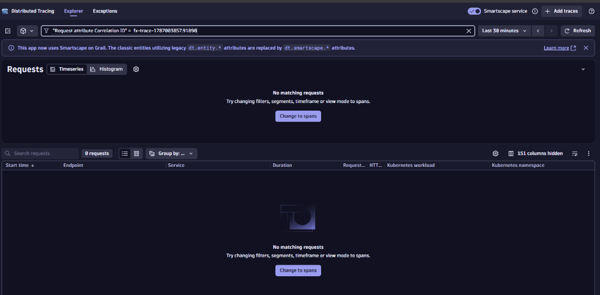

# Tracing Transactions Using Correlation ID in Dynatrace

This guide explains how to trace a single file's journey across all microservices (S1 → S2 → S3 → Database) using a **Correlation ID** in Dynatrace Distributed Tracing.

---

## 1. What is a Correlation ID?

A Correlation ID is a unique identifier assigned to a transaction at the entry point (S1) that gets passed along to every downstream service. In our pipeline, this is the `file_id` (a UUID like `64e1b5d6-6864-4834-8726-750875d8092d`).

### How it flows through the pipeline:



The Java code in S1 generates a UUID, attaches it as the `X-Correlation-Id` HTTP header, and passes it to S2. S2 reads the header and forwards it to S3. This way, every service knows which file it's processing.

---

## 2. The Problem: Dynatrace Ignores Custom Headers by Default

By default, Dynatrace OneAgent captures standard HTTP metadata (URL, method, status code) but **does NOT capture custom headers** like `X-Correlation-Id`.

If you try to filter Distributed Tracing by the header value, you'll get **zero results**:



*The filter `http.request.header.x-correlation-id` returns nothing because Dynatrace wasn't told to capture that header.*

---

## 3. The Solution: Create a Request Attribute

A **Request Attribute** tells Dynatrace OneAgent: *"Hey, whenever you see this HTTP header, capture its value and attach it to the trace so I can search by it later."*

### Step-by-Step Setup:

#### Step 1: Open Request Attributes Settings
1. In Dynatrace, go to **Settings** (gear icon in the left menu).
2. Navigate to **Server-side service monitoring → Request attributes**.
3. Click **Define a new request attribute**.

#### Step 2: Configure the Attribute
Fill in the configuration:
- **Request attribute name:** `Correlation ID`
- **Data type:** `Text`
- **First value** (keep default)
- **Leave text as-is** (keep default)



#### Step 3: Set the Data Source
Scroll down to the **Request attribute source** section:
1. Select **HTTP request header** from the dropdown.
2. For "Specify where the attribute is captured", select **Capture on server side of a web request service**.



3. A new field appears for **Parameter name**. Type:
   ```
   X-Correlation-Id
   ```

#### Step 4: Save
Click the green **Save** button.

> **⚠️ CRITICAL:** The Request Attribute only captures headers for **NEW requests** sent after you create it. Old traces will NOT have the Correlation ID. You must send new traffic through the pipeline after saving!

---

## 4. Tracing a Transaction by Correlation ID

### Step 1: Send a File Through the Pipeline
Send a file via Postman (or curl):

**Postman Setup:**

| Field | Value |
|---|---|
| Method | `POST` |
| URL | `http://localhost:8081/api/files/upload` |
| Body type | `form-data` |
| Key | `file` (type: **File**) |
| Value | Browse and select a `.txt` file (e.g., `fx_1.txt`) |

The response will contain the `fileId` (Correlation ID):
```json
{
  "fileId": "64e1b5d6-6864-4834-8726-750875d8092d",
  "status": "RECEIVED",
  "message": "File successfully processed through all stages. Pipeline: S1 ✅ → S2 ✅ → S3 ✅"
}
```

### Step 2: Search in Distributed Tracing
1. Go to **Distributed Tracing** in Dynatrace.
2. In the filter bar at the top, type: `Correlation ID`.
3. Select the Request Attribute filter that appears.
4. Paste the `fileId` value from the response (e.g., `64e1b5d6-6864-4834-8726-750875d8092d`).
5. Press Enter.

### Step 3: View the Results



Dynatrace shows **all requests** that share the same Correlation ID:

| Time | Endpoint | Service | Duration | Status |
|---|---|---|---|---|
| 08:00:05 | `transform` | TransformationController (S2) | 4.32s | ✅ 200 |
| 08:00:08 | `persist` | PersistenceController (S3) | 1.17s | ✅ 200 |

**What this tells you:**
- S2 (Transformation) took **4.32 seconds** — the heaviest stage.
- S3 (Persistence) took **1.17 seconds** — saving to the database.
- S2 started at `08:00:05`, S3 started at `08:00:08` — S2 processed for ~3 seconds before calling S3.

### Why S1 Doesn't Appear:
S1 (FileUploadController) is the **entry point** that receives the file from Postman. Since Postman doesn't send the `X-Correlation-Id` header (S1 *generates* it), S1's incoming request doesn't have the header attached. S1 only passes it **forward** to S2 and S3.

### Step 4: Click Into a Trace
Click on either the `transform` or `persist` row to open the **Waterfall Trace**. This shows the full code-level breakdown: every `RestTemplate` call, every AOP interceptor, and every database query — all inside that single service call.

---

## 5. Why Old Traces Don't Show Up



If you search for a file ID from **before** you created the Request Attribute, you'll get zero results. This is expected behavior:

| When File Was Sent | Request Attribute Existed? | Searchable? |
|---|---|---|
| Before setup | ❌ No | ❌ Not searchable |
| After setup | ✅ Yes | ✅ Fully searchable |

Dynatrace only captures and stores the header value for requests that arrive **after** the Request Attribute is configured.

---

## 6. Alternative: Using DQL to Trace by Correlation ID

If you need to trace **old files** (or files where the Request Attribute wasn't set up yet), you can use **DQL in Notebooks** to query the Business Events directly:

1. In Dynatrace, go to **Notebooks**.
2. Add a DQL Query section and paste:

```dql
fetch bizevents
| filter file_id == "YOUR_FILE_ID_HERE"
| sort timestamp asc
| fields timestamp, type, stage, status, error_type, error_detail, file_id
```

This works because Business Events (emitted by `BusinessEventEmitter.java`) have always been capturing the `file_id` since day one — independently of the Request Attribute.

### Quick Summary Query:

```dql
fetch bizevents
| filter file_id == "fx-103"
| summarize count(), by: {stage, status}
```

This gives a summary table:

| stage | status | count |
|---|---|---|
| S1_INGESTION | SUCCESS | 1 |
| S2_TRANSFORMATION | SUCCESS | 1 |
| S3_PERSISTENCE | SUCCESS | 1 |

If any row shows `FAILED`, you instantly know which stage crashed.

---

## 7. Summary: Two Ways to Trace by Correlation ID

| Method | Best For | Works on Old Data? |
|---|---|---|
| **Distributed Tracing + Request Attribute** | Infrastructure-level tracing (HTTP calls, DB queries, timings) | ❌ Only new requests |
| **DQL in Notebooks (Business Events)** | Business-level tracing (which stage passed/failed) | ✅ All historical data |

> **Pro Tip for Production:** Use BOTH methods together. The DQL query tells you *what* failed (business context), and the Distributed Trace tells you *why* it failed (code-level details like slow DB queries or network timeouts).
