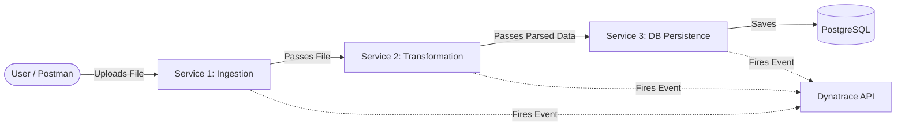

# Dynatrace File Pipeline: Architecture & Flow Guide

This document explains the specific architecture of the pipeline we built for this project. Use this guide to understand exactly how data flows through the code and how Dynatrace tracks it.

---

## 1. High-Level Architecture

The system is a **3-Stage Microservice Pipeline**. A file uploaded by a user travels through three distinct Spring Boot applications. If it successfully passes one stage, it is handed off to the next via HTTP REST calls.



---

## 2. The Golden Thread: `file_id` (Correlation ID)

To track a file across 3 separate servers, Dynatrace needs a way to link the events together. 

When a user uploads a file, they provide an `X-Correlation-Id` header (e.g., `test-001`). This ID becomes the `file_id`. 
Every single time our code talks to Dynatrace, it includes this `file_id`. This allows Dynatrace to stitch the 3 separate events together into a single "Pipeline" journey.

---

## 3. Stage-by-Stage Breakdown

### Stage 1: File Ingestion Service (Port 8081)
**The Bouncer at the Door.**
- **Goal:** Receive the raw file from the user and ensure it is safe and valid.
- **Rules Checked:** 
  1. Is the file too big? (Limit: 10MB)
  2. Is it the right format? (Only `.txt` allowed).
- **Dynatrace Events Fired:**
  - `SUCCESS`: If the file is a valid `.txt` under 10MB.
  - `FAILED`: If it's an `.exe` file or too large (e.g., `error_type: INVALID_FORMAT`).
- **Next Step:** If successful, it forwards the file content to S2.

### Stage 2: File Transformation Service (Port 8082)
**The Translator.**
- **Goal:** Read the raw text and extract structured data from it.
- **Logic:** It looks for specific tags in the text file:
  - `[TITLE]...[/TITLE]`
  - `[LOGO]...[/LOGO]`
  - `[CONTENT]...[/CONTENT]`
  - `[FOOTER]...[/FOOTER]`
- **Dynatrace Events Fired:**
  - `SUCCESS`: All 4 sections were found and extracted perfectly.
  - `FAILED`: If a section is missing (e.g., `error_detail: Missing section [FOOTER]`).
- **Next Step:** If successful, it packages the extracted sections into a JSON object and sends it to S3.

### Stage 3: Database Persistence Service (Port 8083)
**The Vault.**
- **Goal:** Take the cleanly parsed JSON data and save it permanently into the PostgreSQL database.
- **Logic:** Connects to PostgreSQL (Port 5433) using Hibernate/JPA and executes an `INSERT` statement into the `file_documents` table.
- **Dynatrace Events Fired:**
  - `SUCCESS`: The data was successfully saved to the database.
  - `FAILED`: The database was offline, or the password was wrong (e.g., `error_type: DB_CONNECTION_ERROR`).

---

## 4. How the Code Actually Sends Events

In every microservice, there is a class called `BusinessEventEmitter.java`. 

When an event happens (success or fail), this class uses a Spring `RestTemplate` to make an HTTP `POST` request directly to your Dynatrace Tenant URL (`/api/v2/bizevents/ingest`).

**Example of the JSON Payload sent to Dynatrace:**
```json
{
  "type": "com.pipeline.file.transformation",
  "file_id": "test-001",
  "stage": "S2_TRANSFORMATION",
  "status": "FAILED",
  "error_type": "PARSING_ERROR",
  "error_detail": "Missing section [FOOTER]",
  "timestamp": "2026-08-03T12:00:00Z"
}
```

Because we installed **OneAgent**, we get *both*:
1. **Business Analytics:** The custom JSON events we send manually via `BusinessEventEmitter`.
2. **Distributed Tracing (PurePath):** OneAgent automatically records the network timings between S1 -> S2 -> S3 without us writing any code for it.

---

## 5. Failure Scenarios for your Demo

If you are asked how the pipeline handles errors, here is exactly what happens:

1. **Virus Upload (S1 Fails):** S1 rejects it. S2 and S3 are never called. Dynatrace records a single `S1 FAILED` event.
2. **Bad Document (S2 Fails):** S1 accepts it, sends to S2. S2 tries to parse it, realizes it's malformed, and throws an error. S3 is never called. Dynatrace records `S1 SUCCESS` and `S2 FAILED`.
3. **Database Down (S3 Fails):** S1 accepts it, S2 parses it perfectly, S3 tries to save it but PostgreSQL is off. Dynatrace records `S1 SUCCESS`, `S2 SUCCESS`, and `S3 FAILED`.

Because of our Dashboard in Dynatrace, your manager can instantly look at the "Pipeline Stage Health" table and know exactly *where* the files are getting stuck!
