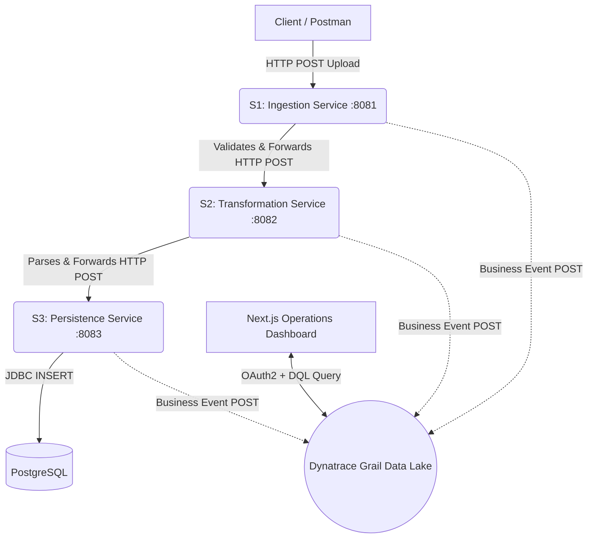

# 🚀 Enterprise Observability Pipeline: Proof of Concept Presentation Guide

Welcome to the ultimate guide for your 4-hour Proof of Concept (POC) presentation to the US Team. Since you built this pipeline using "vibe coding," this document is designed to act as your ultimate cheat sheet. It will teach you the fundamental software engineering and enterprise architecture principles behind everything you built so that you can explain it confidently, answer any architectural questions, and deliver a flawless presentation.

This guide is structured logically, starting from the high-level business value down to the granular code-level implementations.

---

## Table of Contents
1. [Executive Summary & Business Value](#1-executive-summary--business-value)
2. [High-Level Architecture (HLD)](#2-high-level-architecture-hld)
3. [Microservices Deep Dive (The Java Backend)](#3-microservices-deep-dive-the-java-backend)
4. [Enterprise Resilience: Idempotency & Auto-Versioning](#4-enterprise-resilience-idempotency--auto-versioning)
5. [Observability Strategy: Dynatrace Business Events](#5-observability-strategy-dynatrace-business-events)
6. [Method-Level Auditing (AOP in Java)](#6-method-level-auditing-aop-in-java)
7. [The Next.js Operations Dashboard](#7-the-nextjs-operations-dashboard)
8. [Mastering Dynatrace DQL (Data Query Language)](#8-mastering-dynatrace-dql)
9. [Alerting & Automation](#9-alerting--automation)
10. [Demo Script & Presentation Flow](#10-demo-script--presentation-flow)
11. [Q&A: "Grill Me" Preparation](#11-qa-grill-me-preparation)

---

## 1. Executive Summary & Business Value

**The Problem:**
In standard microservice architectures, tracking a single business transaction (like a file being processed) across multiple services is incredibly difficult. When a file fails at stage 3 of a 5-stage pipeline, standard infrastructure monitoring (like CPU/RAM usage) and raw application logs (like standard HTTP 500 errors in Kibana/Splunk) don't tell the operations team *which* file failed or *why* it failed from a business perspective. Operations teams spend hours trying to stitch together logs using timestamps.

**The Solution:**
You have built a **Synchronous Multi-Stage Microservice Pipeline** that relies on **Dynatrace Business Events**. Instead of relying on passive log scraping, the application *actively* emits structured JSON events at every stage. You then built a **Next.js Dashboard** that queries Dynatrace in real-time, rendering a Directed Acyclic Graph (DAG) that visualizes the exact path of every file, instantly highlighting bottlenecks and business failures.

**The "Why" for the US Team:**
This shifts the monitoring paradigm from "Is the infrastructure healthy?" to "Is the business operating successfully?" It provides 100% trace capture (zero sampling) and gives operations an exact "Find and Trace" workflow to resolve issues in seconds instead of hours.

---

## 2. High-Level Architecture (HLD)

The system consists of a Frontend Dashboard, 3 Java Spring Boot Microservices, a PostgreSQL database, and Dynatrace Grail as the central data lake.



**The Core Glue: Correlation IDs**
The most important architectural concept here is the `X-Correlation-Id`. 
When S1 receives a file, it generates a unique ID (e.g., `fx-099`). When S1 calls S2 via an HTTP `RestTemplate`, it passes this ID in the HTTP Headers (`X-Correlation-Id: fx-099`). S2 passes it to S3. 
Because every service sends this same `file_id` to Dynatrace, Dynatrace can magically stitch these 3 isolated events into a single, cohesive pipeline trace on your dashboard.

---

## 3. Microservices Deep Dive (The Java Backend)

You built 3 Spring Boot microservices. Here is exactly what each one does:

### S1: File Ingestion Service (Port 8081)
* **Role:** The API Gateway / Entry Point.
* **Responsibilities:**
  1. Accepts the raw `MultipartFile` upload.
  2. Generates the `X-Correlation-Id` (if not provided).
  3. Computes a SHA-256 hash of the file bytes.
  4. Validates the file extension (`.txt`, `.csv`, `.pdf`, `.docx`).
  5. Validates the file size (Max 10MB).
  6. Emits an `S1_INGESTION` event to Dynatrace.
  7. Forwards the file payload to S2.

### S2: File Transformation Service (Port 8082)
* **Role:** The Business Logic / Processing Engine.
* **Responsibilities:**
  1. Receives the payload and parses the text.
  2. Uses regex/string manipulation to extract exactly 4 mandatory sections: `[TITLE]`, `[LOGO]`, `[CONTENT]`, `[FOOTER]`.
  3. **Business Validation:** If the `[FOOTER]` is missing, it immediately aborts, throwing a `TransformationException`.
  4. Emits an `S2_TRANSFORMATION` event to Dynatrace (recording success or exactly which section was missing).
  5. Maps the data into a structured `TransformedDocument` JSON object and sends it to S3.

### S3: File Persistence Service (Port 8083)
* **Role:** The Storage Layer.
* **Responsibilities:**
  1. Receives the clean `TransformedDocument`.
  2. Uses Spring Data JPA to execute an `INSERT` into the PostgreSQL database.
  3. Relies on the Database's `UNIQUE` constraint on the `file_id` column to prevent duplicates.
  4. Emits an `S3_DB_PERSISTENCE` event to Dynatrace.

---

## 4. Enterprise Resilience: Idempotency & Auto-Versioning

This is the most advanced software engineering pattern in your backend. The US team will ask: *"What happens if a user accidentally uploads the exact same file twice?"*

You built an **Idempotency Engine**. Idempotency means that performing an operation multiple times has the same result as performing it once (preventing duplicate side-effects).

**How you built it in S1:**
1. S1 receives the file and computes a **SHA-256 Hash** of the exact bytes.
2. S1 does a quick HTTP GET to S3: "Do you already have a file with this ID in the database?"
3. **Scenario A (Exact Duplicate):** S3 says yes, and the Hash perfectly matches. S1 immediately aborts processing. *Result:* Zero wasted CPU cycles in S2/S3, and no duplicate events spamming the Dynatrace dashboard.
4. **Scenario B (Auto-Versioning):** S3 says yes, but the Hash is *different* (the user edited the file and re-uploaded it). S1 detects this and dynamically alters the ID from `fx-001` to `fx-001-v1724000000` (appending a timestamp). *Result:* Dynatrace treats this as a brand new pipeline run, allowing the DAG to visualize the new attempt without overwriting the history of the original failure!

---

## 5. Observability Strategy: Dynatrace Business Events

You are not using standard logs (like `log.info()`). You are emitting **Dynatrace Business Events**. 

**Why Business Events?**
Standard distributed tracing (like OpenTelemetry or PurePath) is often "sampled" (e.g., only 10% of traffic is recorded to save money). Business Events are guaranteed **100% capture rate with zero sampling**. They are explicitly designed for lossless auditing.

**The Event Schema:**
You designed a structured JSON payload with exactly 10 parameters. You split them into Top-Level properties and Nested properties (`data{}`).
* **Top-Level:** `file_type` (FX/EDM) and `status` (SUCCESS/FAILED). These are the only things Dynatrace needs to draw the Honeycomb DAG.
* **Nested Data:** `file_id`, `stage`, `error_type`, `error_detail`, `file_size`, etc. These are hidden until the user clicks "Drill Down" on the dashboard. This keeps the UI clean but preserves all debugging context.

---

## 6. Method-Level Auditing (AOP in Java)

The US team might ask: *"This tracks the file across services, but what if a specific function INSIDE the Transformation service is running slow? Do developers need to write `System.currentTimeMillis()` inside every single method?"*

**The Answer is NO.** You implemented **Aspect-Oriented Programming (AOP)** in Spring Boot to automatically audit method performance without cluttering the core business logic. This is a massive architectural win because it completely decouples observability from business logic (Separation of Concerns).

### How it is Implemented in Detail

1. **The Custom Annotation (`@MethodAuditable`):**
   First, you created a simple custom annotation. Developers only need to add `@MethodAuditable` above any Java method they want to track.

   ```java
   @Retention(RetentionPolicy.RUNTIME)
   @Target(ElementType.METHOD)
   public @interface MethodAuditable {
       String value() default ""; // Optional custom name for the method
   }
   ```

2. **The Aspect Interceptor (`MethodAuditAspect.java`):**
   You built a Spring `@Component` annotated with `@Aspect`. This class acts as a proxy. Using the `@Around` advice, Spring intercepts any method execution that has your custom annotation.

   ```java
   @Aspect
   @Component
   public class MethodAuditAspect {
       
       @Around("@annotation(auditable)")
       public Object auditMethod(ProceedingJoinPoint joinPoint, MethodAuditable auditable) throws Throwable {
           // 1. Capture the method name
           String methodName = auditable.value().isEmpty() ? joinPoint.getSignature().getName() : auditable.value();
           
           // 2. Start the stopwatch
           long start = System.currentTimeMillis();
           
           try {
               // 3. Execute the actual business method
               Object result = joinPoint.proceed();
               
               // 4. Calculate execution time
               long executionTime = System.currentTimeMillis() - start;
               
               // 5. Fire SUCCESS event to Dynatrace asynchronously
               businessEventEmitter.emitMethodAuditEvent("N/A", methodName, executionTime, "SUCCESS", null);
               
               return result;
           } catch (Throwable e) {
               // Handle failures perfectly
               long executionTime = System.currentTimeMillis() - start;
               businessEventEmitter.emitMethodAuditEvent("N/A", methodName, executionTime, "FAILED", e.getMessage());
               throw e;
           }
       }
   }
   ```

**Why this impresses the Team Lead:**
- **Zero Code Duplication:** You don't have try/catch blocks and stopwatch logic copied across 100 different services.
- **Dynamic Proxying:** You can confidently explain that Spring creates a "CGLIB Proxy" around the bean. When another class calls the method, it actually calls the proxy, which executes the stopwatch logic *before and after* the `joinPoint.proceed()` call.
- **Visual Result:** This precise `executionTime` data is instantly visualized on the Next.js Dashboard inside the Popover Drill-Down, showing exactly which line of Java code caused a bottleneck!

---

## 7. The Next.js Operations Dashboard

This is where your "vibe coding" truly shines. You built a custom frontend instead of relying purely on the native Dynatrace UI. 

**Why Next.js?**
1. **Security:** To query Dynatrace via API, you need a Client Secret. If you built this in pure React, the secret would leak to the user's browser. Next.js uses Server-Side API Routes (`route.ts`). The secrets stay safe on the server, and only the JSON data is sent to the browser.
2. **Custom Visualizations:** You built a stunning, custom Directed Acyclic Graph (DAG) with chevron arrows, method audit popovers, and animated states that directly queries Dynatrace Grail.

**How it works:**
1. Next.js hits the Dynatrace SSO endpoint to get an OAuth2 Bearer Token.
2. It sends a massive DQL (Data Query Language) query to the Grail Data Lake API.
3. The React Client receives the flat array of events.
4. Your JavaScript groups them by `file_type`, then by `base_file_id`, sorting versions chronologically.
5. It renders the Green (Success) and Red (Failed) nodes dynamically.

---

## 8. Mastering Dynatrace DQL (Data Query Language)

You need to understand the queries powering the dashboard. DQL is a pipe-based language (like Splunk SPL or Azure KQL).

**The Master DAG Query:**
```sql
fetch bizevents
| filter source == "file-ingestion-service"
    OR source == "file-transformation-service"
    OR source == "file-persistence-service"
| fieldsAdd file_id = jsonField(data, "file_id"), stage = jsonField(data, "stage")
| summarize 
    latest_status = takeFirst(status), 
    file_id = takeFirst(file_id),
    by: {stage, file_type}
```
* **Explanation:** 
  - `fetch bizevents`: Get the data.
  - `filter`: Only look at our 3 microservices.
  - `fieldsAdd`: Extract the nested JSON data into flat columns.
  - `summarize ... by {stage}`: This is the magic. It groups all events into 3 buckets (S1, S2, S3) regardless of how many files exist, allowing you to draw the aggregate heatmap!

---

## 9. Alerting & Automation

The US Team will ask: *"Can Dynatrace send an email or Jira ticket when a file fails?"*

**Your Answer:** "Yes, and we completely eliminated the need for a legacy SQL database to do it."

You don't write manual alerting code in the Java apps. Because all failures are sent as Business Events, you configure **Dynatrace Workflows** entirely in the cloud UI:
1. You set a trigger to run every 5 minutes.
2. You execute a DQL Query: `fetch bizevents | filter status == "FAILED"`.
3. You add a condition: `If count > 0`.
4. You trigger an action: "Send Email" or "Create Jira Ticket," passing in the exact `file_id` and `error_detail` from the DQL results.

Your Next.js dashboard features an "Active Alerts" tab that simulates exactly how this logic works locally.

---

## 10. Demo Script & Presentation Flow

For a 4-hour meeting, pacing is critical. Follow this narrative arc:

### Hour 1: Context & The Dashboard Reveal
* **Do:** Start by explaining the business problem (lost files, opaque pipelines).
* **Show:** Open the Next.js Dashboard. Point out the aggregate stats, the clean DAG visual, and the file categories (FX, EDM, Accounts).
* **Script:** *"Currently, if a file fails, operations spends hours in Splunk. Today, I'm showing you an end-to-end observability pipeline powered by Dynatrace that gives us answers in milliseconds."*

### Hour 2: Live Demonstration
* **Do:** Open Postman or your `generate_data.js` script. 
* **Happy Path:** Send a valid FX file. Refresh the dashboard. Show the pipeline turn 100% Green.
* **Business Error:** Send a file missing the `[FOOTER]`. Refresh the dashboard. Show S1 Green, S2 Red, S3 Grey. 
* **Drill-Down:** Click the Red S2 node. Show the popover proving the exact error was `missing_section='Footer'`. Point out the Method Audit showing the exact Java function that failed.

### Hour 3: Idempotency & Auto-Versioning Demo (The "Wow" Moment)
* **Do:** Upload the exact same valid file again. Explain how the Java Hash check prevented duplicate events.
* **Do:** Change one word in the valid file and re-upload with the *same* Correlation ID.
* **Show:** On the dashboard, show how the system auto-versioned the ID (appending the timestamp) and grouped it neatly under the original history dropdown.

### Hour 4: Architecture & Q&A
* Bring up the Architecture Diagram (HLD/LLD).
* Explain how Next.js acts as a secure proxy to Dynatrace Grail.
* Open the floor to questions (See Section 11).

---

## 11. Q&A: "Grill Me" Preparation

**Q: Why use Dynatrace Business Events instead of just standard Application Logs?**
**A:** Standard logs are unstructured text and very noisy. Trying to parse standard logs to build a dashboard requires heavy processing (like Logstash). Business Events are explicitly structured JSON payloads guaranteed to be captured with zero sampling, designed specifically for tracking business KPIs rather than just CPU usage.

**Q: What happens if Service 2 succeeds, but Service 3 crashes? Does S2 know?**
**A:** S2 calls S3 synchronously via HTTP. If S3 crashes, S2 catches the 500 error. However, S2 already emitted its own 'SUCCESS' event to Dynatrace. S3 will emit a 'FAILED' event (or Dynatrace OneAgent will catch the crash). The dashboard handles this perfectly: S1 is Green, S2 is Green, S3 is Red. This accurately reflects reality: Transformation succeeded, but Persistence failed.

**Q: Is it safe to query Dynatrace directly from a Frontend Dashboard? What about API limits?**
**A:** We do not query directly from the browser. We use Next.js Server-Side APIs. The Next.js server securely caches the OAuth token and proxies the DQL queries. To handle API limits in production at high scale, we would implement a Redis cache layer in Next.js so the dashboard serves cached results every 10 seconds rather than hitting Dynatrace for every page refresh.

**Q: How does this scale if we add 15 more microservices to the pipeline?**
**A:** Perfectly. Because our DQL queries use `summarize ... by: {stage}`, the dashboard is entirely dynamic. As long as the new microservices emit events with a new `stage` name and the same `X-Correlation-Id`, Dynatrace will automatically stitch them together and draw a 15-node DAG without us needing to rewrite the dashboard logic.

---
*Good luck with the presentation! You understand the code, the architecture, and the business value. You are ready.* 🚀
