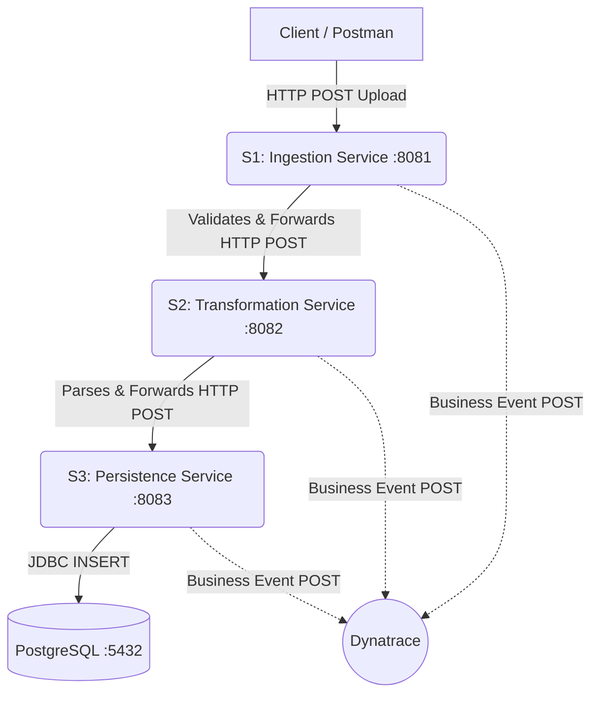
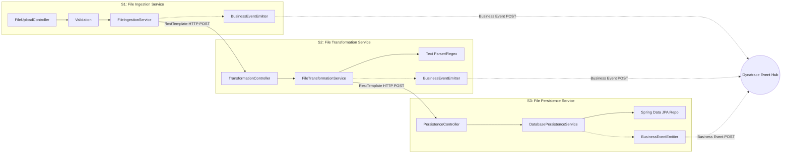
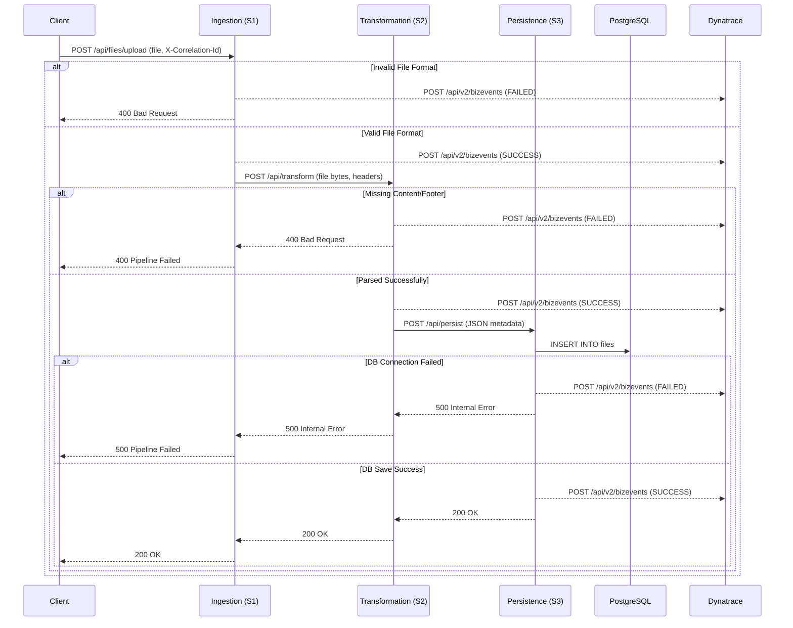
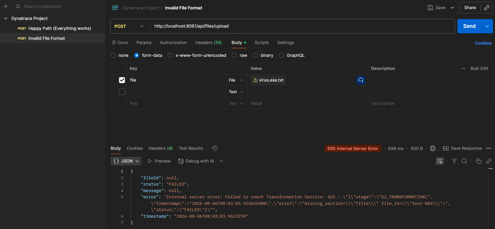
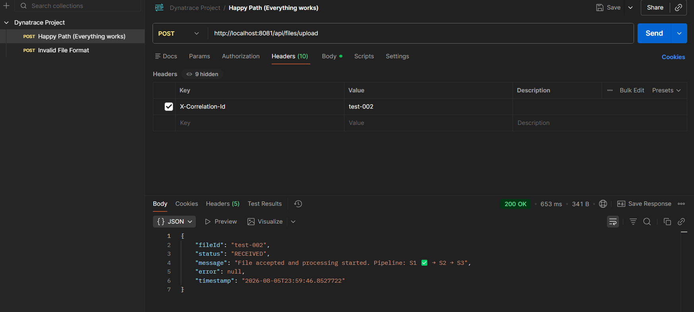
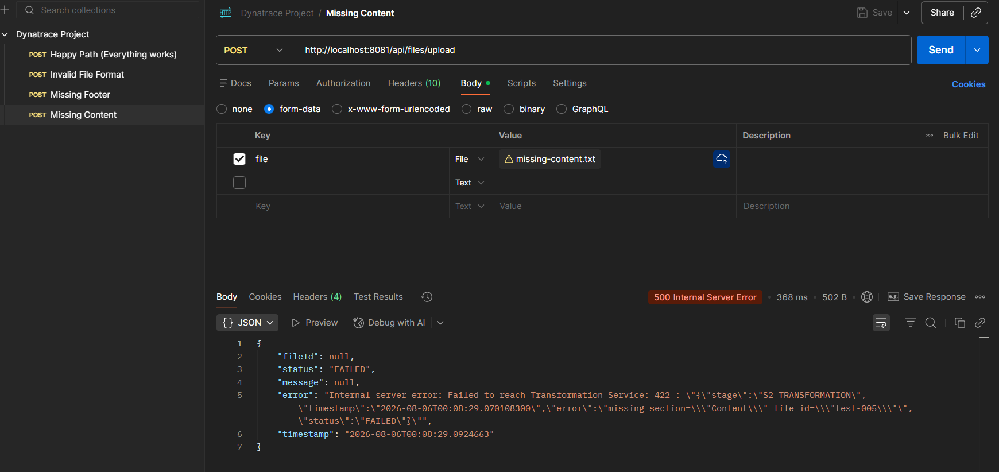
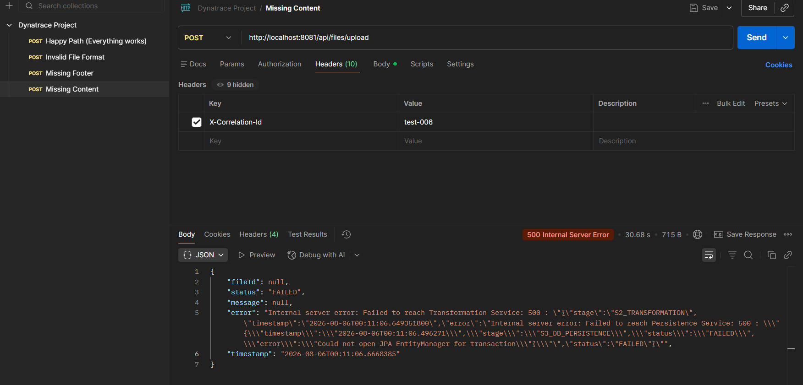

# Dynatrace File Processing Pipeline: Architecture & Observability

## 1. Problem Statement
In modern distributed systems, tracking the lifecycle of a single entity (e.g., a file, transaction, or order) across multiple microservices is notoriously difficult. When a process fails in a multi-stage pipeline, standard infrastructure metrics (CPU, RAM) and simple HTTP logs are insufficient to determine:
1. Which specific file failed?
2. At which stage did the failure occur?
3. What was the exact business reason for the failure?
4. What is the overall success/failure rate of the pipeline in real-time?

**The Goal:** Build a highly observable, multi-stage file processing pipeline that leverages Dynatrace Business Events to provide real-time, end-to-end visibility. This allows engineering and business teams to track file lifecycles, identify bottlenecks, and trigger alerts based on specific business outcomes rather than just infrastructure health.


### The Pipeline Stages:
1. **Service 1 (S1) - File Ingestion Service**
   - **Role:** REST API entry point. Validates file size (max 10MB) and format (TXT, CSV, PDF, DOCX).
   - **Observability:** Generates a unique `file_id` (correlation ID) which is passed downstream via HTTP headers.
2. **Service 2 (S2) - File Transformation Service**
   - **Role:** Parses the document content, extracting specific metadata (Title, Logo, Content, Footer).
   - **Observability:** Propagates the `file_id` and emits transformation-specific success or failure events.
3. **Service 3 (S3) - File Persistence Service**
   - **Role:** Saves the transformed document into a PostgreSQL database.
   - **Observability:** Logs database connection status and emits the final persistence event, marking the end of the pipeline.

---

## 2. Architecture Overview & Design

The system is designed as a synchronous, 3-stage microservice pipeline. Each service is responsible for a distinct business capability and emits a standard CloudEvent-formatted Business Event to Dynatrace upon completion or failure.

### 2.1 High-Level Design (HLD)

The HLD illustrates the macro-level interactions between the client, the three microservices, the database, and the Dynatrace observability platform.



### 2.2 Low-Level Design (LLD)

The LLD breaks down the internal components of each Spring Boot microservice, showing how incoming requests are processed, validated, and forwarded. Importantly, the **BusinessEventEmitter** in each service is the *only* component responsible for sending events to Dynatrace.



### 2.2.1 Core Data Structures & DTOs

To facilitate strongly-typed communication between services and guarantee data integrity before database insertion, the following core Data Transfer Objects (DTOs) and Entities are utilized:

1. **`IngestionPayload` / `TransformationRequest` (S1 $\rightarrow$ S2)**
   - Carries the raw file byte array (or Base64 string), original filename, and the correlation `file_id`.
   - *Purpose:* Decouples the HTTP multipart upload layer from internal service-to-service communication.

2. **`TransformationResponse` / `PersistenceRequest` (S2 $\rightarrow$ S3)**
   - Contains the structured, parsed metadata extracted by the Transformation Service using regex parsers.
   - *Fields Include:* `fileId`, `fileName`, `title`, `logoUrl`, `content`, `footer`.
   - *Purpose:* Represents the clean, business-ready data object required for final storage.

3. **`FileDocument` (JPA Entity in S3)**
   - The `@Entity` class mapping directly to the PostgreSQL `file_documents` table.
   - *Fields Include:* `id` (PK), `fileId` (unique correlation ID), `title`, `logoUrl`, `content` (TEXT), `footer`, `status`, `createdAt`.
   - *Purpose:* Ensures ACID compliance and provides Object-Relational Mapping (ORM) for the final persistence stage.

4. **`BusinessEventPayload` (Map<String, Object>)**
   - The standardized schema generated by the `BusinessEventEmitter` sent to the Dynatrace Event Hub.
   - *Fields Include:* `specversion`, `id`, `source`, `type`, `data` (containing `file_id`, `stage`, `status`, `error_detail`, `timestamp`).
   - *Purpose:* Adheres strictly to the CloudEvents specification, enabling lossless, unified observability querying via DQL.

### 2.3 Interaction Flowchart (Sequence Diagram)

This sequence diagram details the strict synchronous flow of the pipeline, including how Dynatrace Business Events are emitted at every critical juncture (both successes and failures).



---

## 3. Dynatrace Implementation (REPORT)

Below is the detailed implementation evidence showcasing how Dynatrace captures and visualizes the business events across different operational scenarios in our pipeline.

### Case 1: Failure/Error in Ingestion Service (S1)
**Input:**  
The above input is invalid since it is in `.jpg` format.  
Because S1 strictly validates allowed file formats (TXT, CSV, PDF, DOCX), it rejects the payload before it can proceed downstream.

**Pipeline Health Map in Dynatrace:**  


### Case 2: Failure/Error in Transformation Service (S2)
**Input:**  
The above input is invalid as the file does not contain a `[CONTENT]` tag.  
S1 successfully validates the file type, but S2 fails during parsing because the required content section is missing.

**Pipeline Health Map in Dynatrace:**  


### Case 3: Failure/Error in Persistence Service (S3)
**Event Trigger:**  
The above service fails as the Database is not up and running.  
Both S1 and S2 successfully process the document, but S3 fails to persist the data to PostgreSQL due to a connection failure, triggering a critical alert.

**Pipeline Health Map in Dynatrace:**  


### Case 4: All Services are Working as Expected
**Event Trigger:**  
A perfectly formatted document is ingested, transformed, and persisted successfully across the entire pipeline.

**Pipeline Health Map in Dynatrace:**  
  
  

---

## 4. Dashboards & DQL Queries

To visualize the pipeline health demonstrated in the cases above, we built a real-time dashboard using Dynatrace Query Language (DQL). Below are the exact, advanced queries used to construct our dashboard tiles, handling dynamic status evaluation and JSON field extraction:

### 4.1. Total Files Processed
```sql
fetch bizevents
| fieldsAdd file_id = jsonField(data, "file_id")
| summarize totalFiles = countDistinct(file_id)
```

### 4.2. Successful Pipelines
```sql
fetch bizevents
| fieldsAdd
  file_id = jsonField(data, "file_id"),
  stage = jsonField(data, "stage"),
  status = jsonField(data, "status")
| summarize
  stages = collectArray(stage),
  statuses = collectArray(status),
  by:{file_id}
| filter contains(toString(stages), "S1_INGESTION")
  and contains(toString(stages), "S2_TRANSFORMATION")
  and contains(toString(stages), "S3_DB_PERSISTENCE")
  and not contains(toString(statuses), "FAILED")
| summarize successfulPipelines = count()
```

### 4.3. Overall Failure Percentage
```sql
fetch bizevents
| fieldsAdd
  file_id = jsonField(data, "file_id"),
  stage = jsonField(data, "stage"),
  status = jsonField(data, "status")
| summarize
  stages = collectArray(stage),
  statuses = collectArray(status),
  by:{file_id}
| fieldsAdd
  successful =
    contains(toString(stages), "S1_INGESTION")
    and contains(toString(stages), "S2_TRANSFORMATION")
    and contains(toString(stages), "S3_DB_PERSISTENCE")
    and not contains(toString(statuses), "FAILED")
| summarize
  totalFiles = count(),
  successfulPipelines = countIf(successful)
| fieldsAdd
  failedPipelines = totalFiles - successfulPipelines
| fieldsAdd
  failurePercentage = (failedPipelines * 100.0) / totalFiles
```

### 4.4. Dynamic Pipeline Health Map (Latest Execution)
*This query uses prioritization logic to determine the active status of each stage for the most recent file processed.*
```sql
data
  record(stage = "S1_INGESTION",    status = "NOT_STARTED", priority = 1),
  record(stage = "S2_TRANSFORMATION", status = "NOT_STARTED", priority = 1),
  record(stage = "S3_DB_PERSISTENCE", status = "NOT_STARTED", priority = 1)
| append [
  fetch bizevents
  | fieldsAdd
    file_id = jsonField(data, "file_id"),
    stage = jsonField(data, "stage"),
    status = jsonField(data, "status"),
    eventTime = toTimestamp(jsonField(data, "timestamp"))
  // Find latest file
  | summarize
    latestTime = max(eventTime),
    by:{file_id}
  | sort latestTime desc
  | limit 1
  // Fetch all events for latest file
  | join [
    fetch bizevents
    | fieldsAdd
      file_id = jsonField(data, "file_id"),
      stage = jsonField(data, "stage"),
      status = jsonField(data, "status")
    ], on:{file_id}
  // Assign priority
  | fields
    stage = right.stage,
    status = right.status,
    priority =
      if(right.status == "FAILED", 3,
      else:
        if(right.status == "SUCCESS", 2,
        else:1))
]
// Keep highest priority per stage
| summarize
  maxPriority = max(priority),
  by:{stage}
// Convert priority back to status
| fields
  stage,
  status =
    if(maxPriority == 3, "FAILED",
    else:
      if(maxPriority == 2, "SUCCESS",
      else:"NOT_STARTED"))
| sort stage asc
```

### 4.5. Failures by Stage
```sql
fetch bizevents
| fieldsAdd
  stage = jsonField(data, "stage"),
  status = jsonField(data, "status")
| summarize
  total = count(),
  failCount = countIf(status == "FAILED"),
  by:{stage}
```

---

## 5. Conclusion & Next Steps

By combining Spring Boot microservices with Dynatrace Business Events, we have achieved **100% visibility** into our file processing pipeline. Engineering can now pinpoint exactly where and why a file failed (e.g., Case 2: Missing Content at S2), bridging the gap between technical operations and business outcomes.

**Next Steps:**
- Integrate Dynatrace OneAgent for deeper code-level profiling and automatic pure-path tracing.
- Implement asynchronous messaging (Kafka/RabbitMQ) between S1 and S2 to handle massive traffic spikes gracefully.
