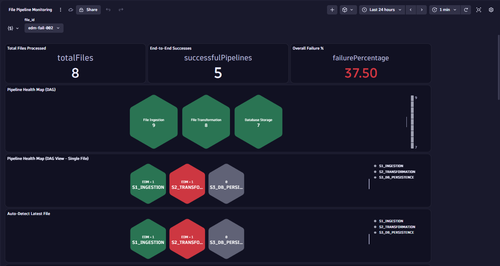
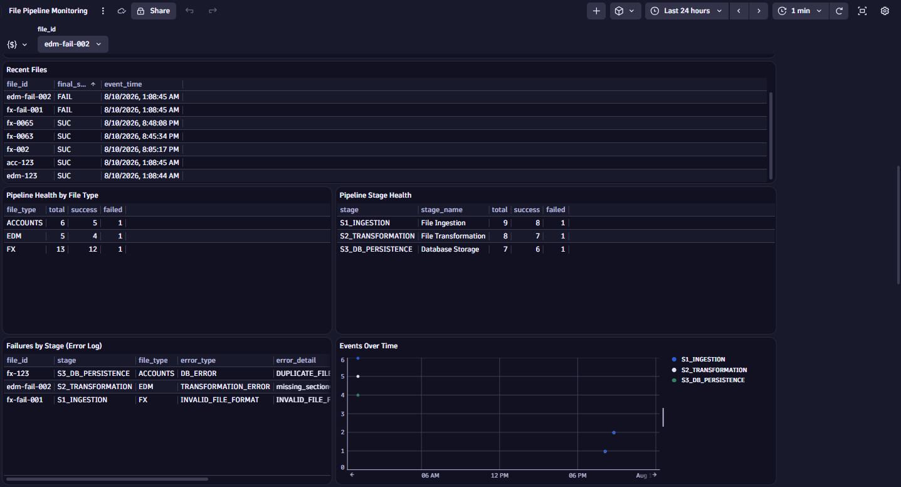
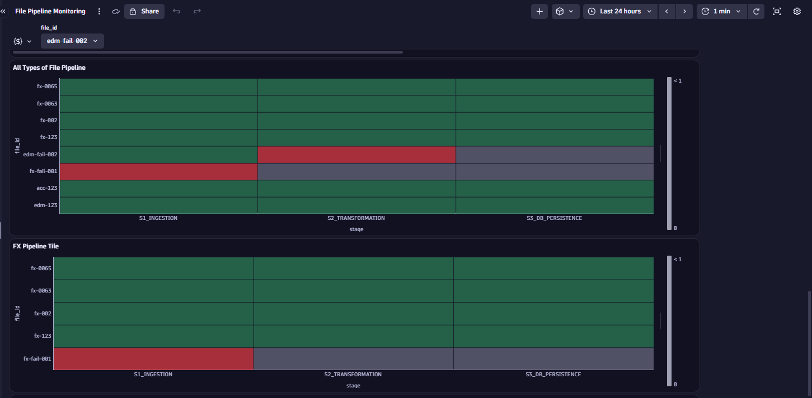
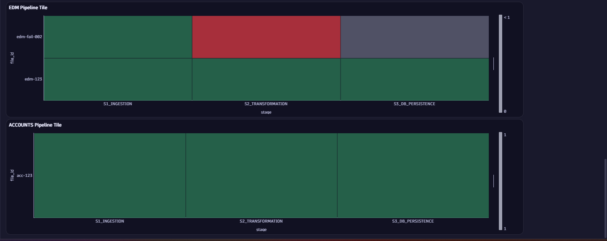
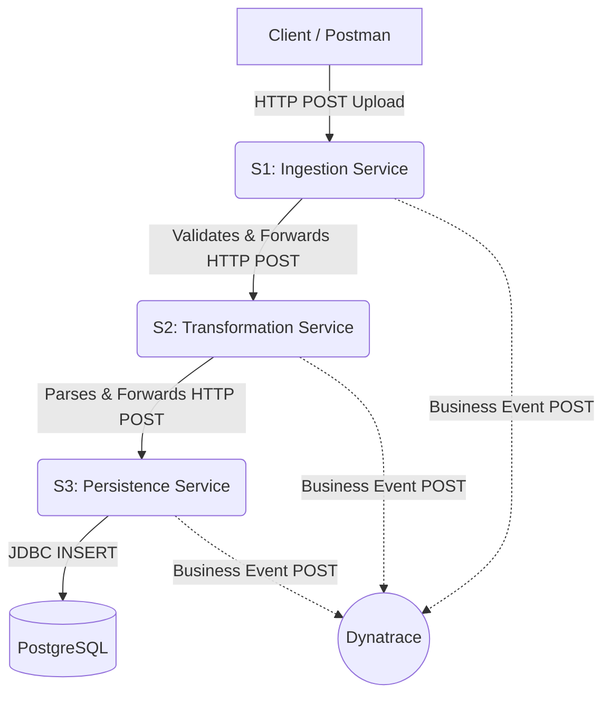
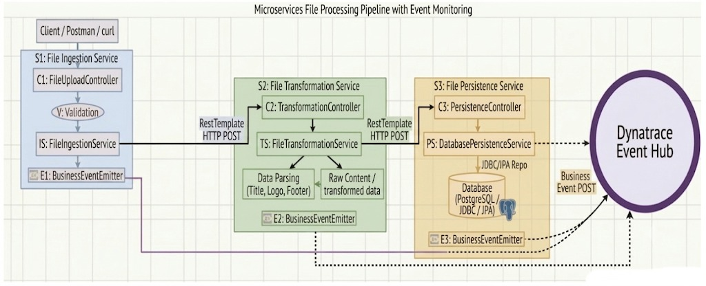
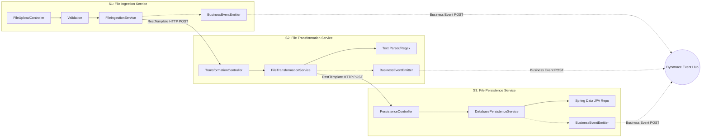
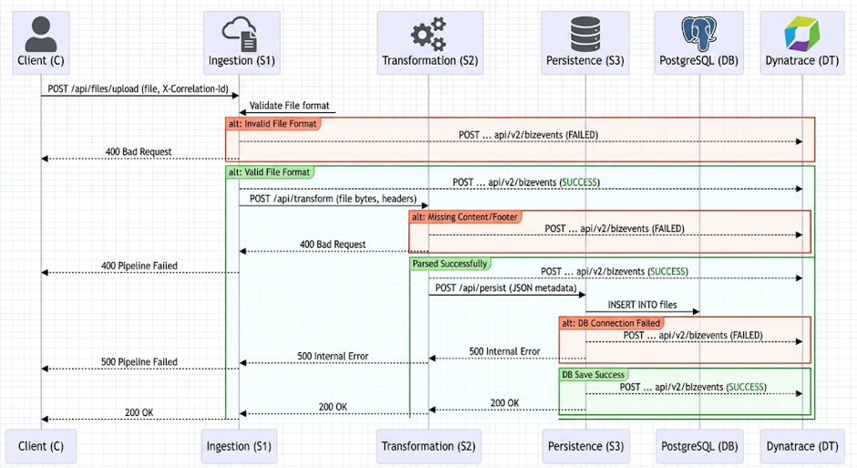

# Dynatrace File Processing Pipeline: Enterprise Architecture & Observability

## 1. Problem Statement
In modern distributed systems, tracking the lifecycle of a single entity (e.g., a file, transaction, or order) across multiple microservices is notoriously difficult. When a process fails in a multi-stage pipeline, standard infrastructure metrics (CPU, RAM) and simple HTTP logs are insufficient to determine:
1. Which specific file failed?
2. At which stage did the failure occur?
3. What was the exact business reason for the failure?
4. What is the overall success/failure rate of the pipeline in real-time?

**The Goal:** Build a highly observable, multi-stage file processing pipeline that leverages **Dynatrace Business Events** to provide real-time, end-to-end visibility. This architecture is designed to scale to 20+ microservices, allowing engineering and business teams to track file lifecycles, identify bottlenecks, and trigger alerts based on specific business outcomes rather than just infrastructure health.

---

## 2. The Final Enterprise Dashboard
This is the final, production-ready React/Next.js dashboard generated by the pipeline. It features a native, deeply-interlocking **Honeycomb DAG** (matching Dynatrace's exact aesthetic), live error feeds, context-menu popovers for granular field drill-downs, and aggregate statistics for the manager and operations team.

### Dashboard Overview & Pipeline DAG


### Live Error Feed & Metrics


### FX & Unified Pipeline Heatmaps


### EDM & Accounts Heatmaps


---

## 3. Pipeline Architecture & Flow

The system is designed as a synchronous, 3-stage microservice pipeline. Each service is responsible for a distinct business capability and emits a standard CloudEvent-formatted Business Event to Dynatrace upon completion or failure.

### The Pipeline Stages:
1. **Service 1 (S1) - File Ingestion Service (Port 8081)**
   - **Role:** REST API entry point. Validates file size (max 10MB) and format (TXT, CSV, PDF, DOCX).
   - **Observability:** Generates a unique `X-Correlation-Id` (the `file_id`) which is passed downstream via HTTP headers.
2. **Service 2 (S2) - File Transformation Service (Port 8082)**
   - **Role:** Parses the document content, extracting specific metadata (Title, Logo, Content, Footer).
   - **Observability:** Propagates the `file_id` and emits transformation-specific success or failure events.
3. **Service 3 (S3) - File Persistence Service (Port 8083)**
   - **Role:** Saves the transformed document into a PostgreSQL database.
   - **Observability:** Logs database connection status, catches duplicate data errors, and emits the final persistence event.

### 2.1 High-Level Design (HLD)



### 2.2 Low-Level Design (LLD)







---

## 3. Data Structures & Business Events

A critical requirement of this architecture is how data is structured and sent to Dynatrace. We transmit **10 distinct parameters** per event, but UI requirements dictate that only 2 are painted on the Honeycomb surface, while the remaining 8 are stored in the drill-down.

### 3.1 The 10 Parameters
To achieve this UI separation, we split the JSON payload into Top-Level and Nested properties:

**Top-Level (Mapped to UI Names):**
1. `file_type`: (e.g., FX, EDM, ACCOUNTS)
2. `status`: (SUCCESS or FAILED)

**Nested Data Block (Available on Drill-Down):**
3. `file_id`: Unique Correlation ID.
4. `stage`: Stage identifier (e.g., S1_INGESTION).
5. `stage_name`: Human-readable stage name.
6. `error_type`: High-level error categorization.
7. `error_detail`: Exact exception message or business logic failure reason.
8. `file_size`: Size of the file in bytes.
9. `file_extension`: (e.g., .txt).
10. `timestamp`: ISO-8601 timestamp of the event.

**Sample JSON Payload emitted to Dynatrace:**
```json
{
  "specversion": "1.0",
  "id": "uuid-1234",
  "source": "file-ingestion-service",
  "type": "com.pipeline.file.ingested",
  "file_type": "FX",
  "status": "SUCCESS",
  "data": {
    "file_id": "fx-099",
    "stage": "S1_INGESTION",
    "stage_name": "File Ingestion",
    "error_type": "NONE",
    "error_detail": "NONE",
    "file_size": 1024,
    "file_extension": ".txt",
    "timestamp": "2023-10-27T10:00:00Z"
  }
}
```

### 3.2 Data Integrity, Idempotency & Auto-Versioning
The architecture gracefully handles file re-uploads and duplicates:
- **Exact Duplicate Data (Idempotency):** If a file is uploaded again and its content has not changed, the pipeline intelligently drops it to save processing power.
- **Content Changed (Auto-Versioning):** If the content has changed but the Correlation ID (`file_id`) remains the same, the pipeline **auto-versions** the file (e.g., `fx-01` becomes `fx-01-v1786628851`). 
- **Database Conflicts:** If a duplicate accidentally reaches the Persistence Service, it triggers a `DataIntegrityViolationException`, safely caught without crashing the pipeline, emitting a `FAILED` event with `error_detail: DUPLICATE_FILE`.

The Next.js dashboard automatically detects these auto-versioned timestamps, elegantly grouping all historical versions of a file under its original Base Correlation ID within a dropdown list!

---

## 4. Enterprise Operations Workflow

In a production environment processing thousands of concurrent files, the Dynatrace dashboard is used as an **Aggregate Heatmap**, not a single-file tracker.

### The "Find and Trace" Workflow:
1. **Aggregate Monitoring:** The Operations Team monitors the "Overall Failure %" and the DAG Honeycomb (which tracks the total number of failures per stage).
2. **Identifying the Culprit:** If the S3 Honeycomb turns Red, the team looks at the **Failures by Stage (Error Log)** table on the dashboard. This table streams live errors, providing the exact `file_id` (e.g., `fx-8924`) that failed.
3. **Deep Dive Tracing:** The team copies `fx-8924`, opens a Dynatrace Notebook, and pastes it into the DAG query. The DAG instantly filters out the noise of thousands of files and draws the exact multi-hop path of `fx-8924`, showing precisely where it broke. They can then "Open with Notebook" on the Red node to read the 8 nested parameters (like `DUPLICATE_FILE`).

---

## 5. Dynatrace DQL Queries (Dashboard Blueprint)

Below are the optimized DQL queries used to power the enterprise dashboard.

### 5.1 Pipeline Health Map (DAG)
Groups by `stage` and `file_type` to draw the multi-hop Honeycomb DAG.
```sql
fetch bizevents
| filter source == "file-ingestion-service"
    OR source == "file-transformation-service"
    OR source == "file-persistence-service"
| fieldsAdd
    file_id = jsonField(data, "file_id"),
    stage = jsonField(data, "stage"),
    stage_name = jsonField(data, "stage_name"),
    error_type = jsonField(data, "error_type"),
    error_detail = jsonField(data, "error_detail"),
    file_size = jsonField(data, "file_size"),
    file_extension = jsonField(data, "file_extension")
| filter file_id == "fx-099"    // Remove this filter for aggregate heatmap view
| sort timestamp desc
| summarize 
    latest_status = takeFirst(status), 
    events = count(),
    file_id = takeFirst(file_id),
    stage_name = takeFirst(stage_name),
    error_type = takeFirst(error_type),
    error_detail = takeFirst(error_detail),
    file_size = takeFirst(file_size),
    file_extension = takeFirst(file_extension),
    event_time = takeFirst(timestamp),
    by: {stage, file_type}
| sort stage asc
```

### 5.2 Failures by Stage (Error Drill-Down Log)
Acts as a live feed of broken files for the Operations Team.
```sql
fetch bizevents
| filter source == "file-ingestion-service"
    OR source == "file-transformation-service"
    OR source == "file-persistence-service"
| fieldsAdd
    file_id = jsonField(data, "file_id"),
    stage = jsonField(data, "stage"),
    error_type = jsonField(data, "error_type"),
    error_detail = jsonField(data, "error_detail")
| filter status == "FAILED"
| fields file_id, file_type, stage, error_type, error_detail, timestamp
| sort timestamp desc
```

### 5.3 Pipeline Health by File Type
Tracks success/failure throughput categorized by business verticals (FX, EDM, ACCOUNTS).
```sql
fetch bizevents
| filter source == "file-ingestion-service"
    OR source == "file-transformation-service"
    OR source == "file-persistence-service"
| fieldsAdd stage = jsonField(data, "stage")
| summarize 
    total = count(),
    success = countIf(status == "SUCCESS"),
    failed = countIf(status == "FAILED"),
    by: {file_type, stage}
```

---

## 6. How to Run Locally

1. Start the PostgreSQL Database and 3 Spring Boot Microservices:
```powershell
.\start-pipeline.ps1
```
2. Send test files via Postman or `curl`:
```powershell
curl -X POST "http://localhost:8081/api/files/upload" -F "file=@sample-files/valid-document.txt" -F "file_type=FX" -H "X-Correlation-Id: fx-001"
```
```powershell
curl -X POST "http://localhost:8081/api/files/upload" -F "file=@sample-files/valid-document.txt" -F "file_type=EDM" -H "X-Correlation-Id: edm-001"
```
```powershell
curl -X POST "http://localhost:8081/api/files/upload" -F "file=@sample-files/valid-document.txt" -F "file_type=ACCOUNTS" -H "X-Correlation-Id: acc-001"
```


