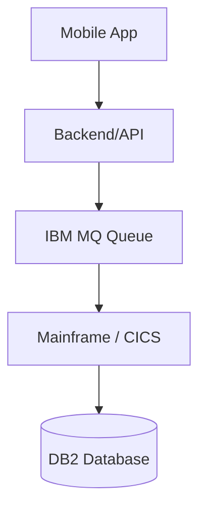
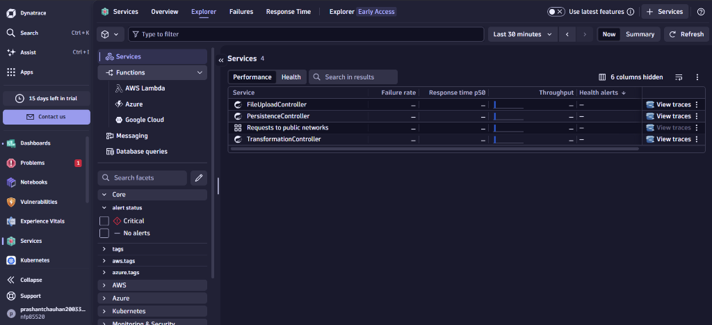
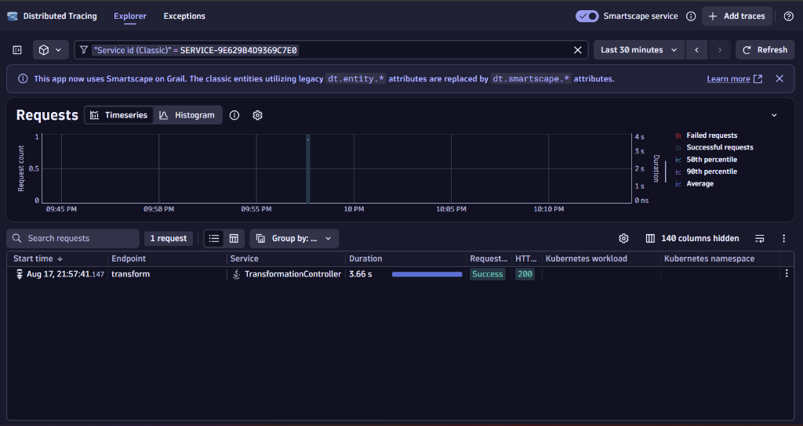
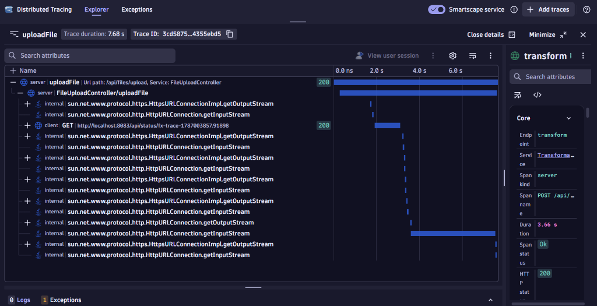
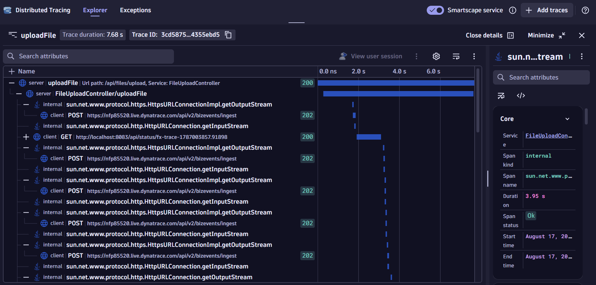
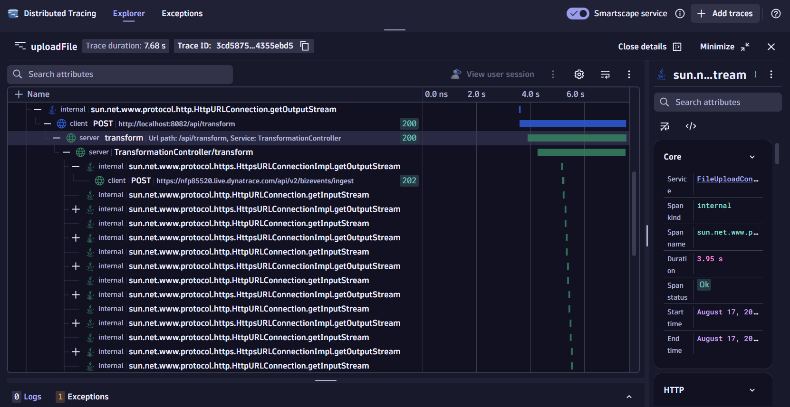
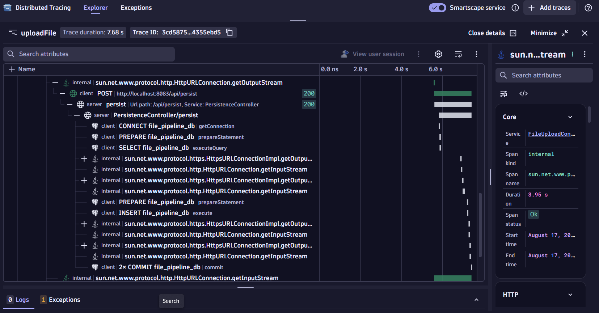
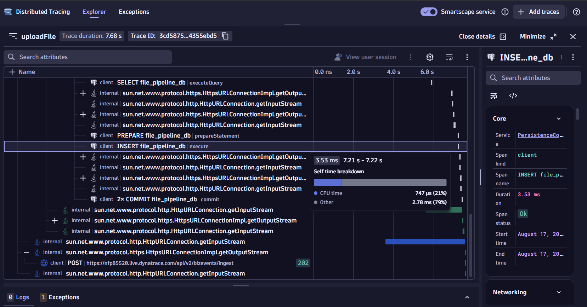

# Complete Guide to Distributed Transaction Tracing in Dynatrace

This document explains the concept of end-to-end transaction tracing, how it solves traditional monitoring silos, and how it differs from the custom Business Observability built in this POC. 

---

## 1. The Core Problem: Monitoring Silos

Imagine a complex enterprise application (like a banking app):



When a user requests their account balance, the request travels through all these systems. Traditionally, different teams monitor their own silos:
* The mobile/API team sees the mobile app and backend.
* The mainframe team sees the CICS transaction and DB2 database.

If a transaction fails, it is incredibly difficult to determine *which* system caused the failure. Did the API crash, or did the database throw an error?

## 2. The Solution: End-to-End Distributed Tracing

Dynatrace solves this by automatically discovering and mapping the entire journey on a transaction level. Instead of monitoring isolated systems, Dynatrace connects them.

### Key Terminology

*   **Distributed Trace (PurePath):** The complete story of *one specific request* across multiple services. It tracks a single user interaction (e.g., clicking "Submit") from the frontend all the way down to the specific SQL database query, recording exactly how many milliseconds were spent at every hop.
*   **Service Flow:** The high-level architectural view showing how components communicate with each other overall (e.g., Mobile -> API -> MQ -> DB2).
*   **Service Backtrace:** A view that answers "Who is calling this service?". Instead of tracing forward, it traces backward to identify the callers (e.g., tracing from the Mainframe backward to see that the Web Application called it 5,000 times).

*(Note on Mainframe concepts often seen in Enterprise: **CICS** is an IBM transaction processing system, **IBM MQ** is a messaging queue, and **DB2** is an IBM relational database. Dynatrace can trace seamlessly through all of these.)*

---

## 3. Business Observability vs. Distributed Tracing

It is critical to understand the difference between the two paradigms used in this POC:

### A. Business Observability (The Custom Pipeline DAG)
*   **What it tracks:** The *business entity* (e.g., the FX File).
*   **How it works:** Explicit Java code was written (`BusinessEventEmitter.java`) to send custom Business Events via HTTP to Dynatrace Grail.
*   **The Result:** The custom Next.js DAG dashboard. It tells you "File `fx-103` successfully passed S1, S2, and S3." It groups events using the `X-Correlation-Id` (`file_id`). It does not track CPU, memory, or network hops.

### B. Distributed Tracing (Native Dynatrace OneAgent)
*   **What it tracks:** The *technical infrastructure and network requests*.
*   **How it works:** **OneAgent** is installed on the host OS. It magically injects itself into the Java Virtual Machine (JVM). No code changes are required.
*   **The Result:** The Dynatrace UI Waterfall view. It tracks the HTTP request entering S1, the `RestTemplate` call to S2, and the JDBC SQL `INSERT` statement in S3. 

> [!TIP]
> **The "Holy Grail" of Observability:** Enterprise teams use BOTH. The Operations team looks at the Next.js Business Dashboard to see *which file failed*. The DevOps engineer then clicks into the Dynatrace PurePath (OneAgent) to see *exactly which line of code or database query caused the crash*.

---

## 4. Setting up OneAgent (Handling Account Changes)

OneAgent is hardcoded to a specific Dynatrace Tenant (account) at the time of installation. If you create a new Dynatrace free trial, the old OneAgent will attempt to send data to the expired account and fail.

### How to reconnect OneAgent to a new account:

**Option 1: Reinstall (Easiest for Windows)**
1. Go to Windows **Add or Remove Programs** and uninstall "Dynatrace OneAgent".
2. Log into the NEW Dynatrace account.
3. Go to **Deploy Dynatrace -> Start Installation -> Windows**.
4. Click **Generate Token**, download the `.exe`, and run the installer.
5. **Restart your Spring Boot applications** (S1, S2, S3). OneAgent only hooks into Java processes when they boot up.

**Option 2: Reconfigure via Command Line**
Run this in an Administrator PowerShell (replace brackets with your new tenant info):
```powershell
cd "C:\Program Files\dynatrace\oneagent\agent\tools"
.\oneagentctl.exe --set-server=https://{YOUR_NEW_TENANT_ID}.live.dynatrace.com:443 --set-tenant={YOUR_NEW_TENANT_ID} --set-tenant-token={YOUR_NEW_TENANT_TOKEN}
Restart-Service -Name "Dynatrace OneAgent"
```

---

## 5. How to View Transaction Traces in Dynatrace

Once OneAgent is running and your Spring Boot apps have been restarted, send traffic through your system (e.g., upload a file via Postman). 

### Viewing the Waterfall Trace:
1. In Dynatrace, go to **Services** (under Observe and explore).
2. Dynatrace automatically names Java services based on the Spring Boot Controller class. You will see services like:
   * `FileUploadController` (S1)
   * `TransformationController` (S2)
   * `PersistenceController` (S3)



3. Click the **View traces** button next to the `FileUploadController` or `TransformationController`.
4. You will see the **Distributed Tracing Explorer**, listing individual requests.



5. Click on the endpoint (e.g., `uploadFile` or `transform`) to open the **Waterfall Trace**.

### Understanding the Waterfall View:



*   **Trace Duration:** The total time the transaction took from start to finish.
*   **The Tree (Left side):** Shows the parent-child execution order. You will see the top-level S1 controller, and nested underneath it, the `internal` `RestTemplate` HTTP calls your code makes to S2, S3, and the Dynatrace API.
*   **The Timeline (Right side):** Blue bars represent execution time. A long blue bar immediately identifies a performance bottleneck.
*   **Details Panel:** Clicking any row reveals the exact HTTP status code, timings, and exceptions.

### Tracking Database Queries

OneAgent automatically intercepts JDBC drivers (like Spring Data JPA/Hibernate).
*   **Inside a Trace:** Under the `PersistenceController` (S3) node in the waterfall, you will see a specific node for PostgreSQL. Clicking it reveals the *exact SQL statement* executed (e.g., `INSERT INTO files...`) and how many milliseconds the database took to respond.
*   **Global Database View:** To find the slowest queries across your entire application, navigate to **Database queries** in the left-hand menu of Dynatrace. It aggregates all SQL executions and automatically highlights slow or failing queries.





