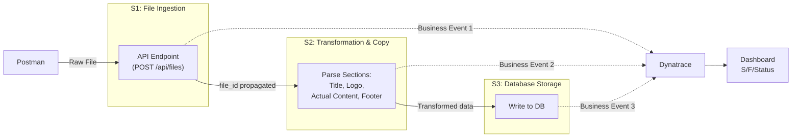

# Dynatrace File Processing Pipeline — Complete Implementation Guide

> **For:** Prash (Beginner to Dynatrace)  
> **Task:** Trace a 3-stage File Pipeline ($S_1 → S_2 → S_3$), track current execution state, and detect failures at each stage.

---

## Table of Contents

1. [What You Need to Learn First](#1-what-you-need-to-learn-first)
2. [Architecture Overview](#2-architecture-overview)
3. [Prerequisites & Setup](#3-prerequisites--setup)
4. [Stage-by-Stage Implementation](#4-stage-by-stage-implementation)
5. [Dynatrace Configuration](#5-dynatrace-configuration)
6. [Dashboard & Alerting Setup](#6-dashboard--alerting-setup)
7. [Testing & Verification](#7-testing--verification)
8. [Common Mistakes to Avoid](#8-common-mistakes-to-avoid)

---

## 1. What You Need to Learn First

> [!IMPORTANT]
> Before touching any Dynatrace config, spend **2-3 days** learning these concepts. This will save you weeks of confusion later.

### 1.1 Dynatrace Core Concepts (Learn in this order)

| # | Topic | What It Is | Time to Learn | Resource |
|---|-------|-----------|---------------|----------|
| 1 | **OneAgent** | A lightweight agent installed on your server/container that auto-discovers services, processes, and hosts | 1 hour | [Dynatrace OneAgent Docs](https://docs.dynatrace.com/docs/setup-and-configuration/dynatrace-oneagent) |
| 2 | **Entities & Topology** | How Dynatrace maps your infrastructure — Hosts, Services, Processes, and their relationships | 1 hour | [Entity Model](https://docs.dynatrace.com/docs/shortlink/entities) |
| 3 | **PurePath / Distributed Traces** | End-to-end traces that follow a request across services (this is how S1→S2→S3 gets linked automatically) | 2 hours | [PurePath Docs](https://docs.dynatrace.com/docs/shortlink/purepath) |
| 4 | **Business Events** | Custom events you emit from your code to track business milestones (e.g., "file received", "file transformed") | 2 hours | [Business Events API](https://docs.dynatrace.com/docs/shortlink/business-events) |
| 5 | **Custom Request Attributes** | Key-value metadata you attach to traces (e.g., `file_id`, `file_size`) | 1 hour | [Request Attributes](https://docs.dynatrace.com/docs/shortlink/request-attributes) |
| 6 | **Metric Events & Alerting** | How to set up alerts when thresholds are breached | 1 hour | [Metric Events](https://docs.dynatrace.com/docs/shortlink/metric-events) |
| 7 | **Dashboards & DQL** | Dynatrace Query Language for building custom dashboards | 2 hours | [DQL Docs](https://docs.dynatrace.com/docs/shortlink/dql) |
| 8 | **Log Ingestion** | Sending and querying application logs in Dynatrace | 1 hour | [Log Monitoring](https://docs.dynatrace.com/docs/shortlink/log-monitoring) |

### 1.2 Spring Boot Specific Learning

Since your services are likely Spring Boot (based on your other projects), learn these:

| Topic | Why You Need It |
|-------|----------------|
| **Dynatrace Spring Boot Starter** | Auto-configures OneAgent SDK in your Spring Boot app |
| **Micrometer + Dynatrace** | Export Spring Boot Actuator metrics to Dynatrace |
| **OpenTelemetry (OTel) with Dynatrace** | Industry-standard tracing that Dynatrace natively supports |

### 1.3 Recommended Learning Path (Day-by-Day)

```
Day 1: Learn OneAgent, Entities, PurePath (watch Dynatrace YouTube tutorials)
Day 2: Learn Business Events API + Request Attributes
Day 3: Learn DQL + Dashboards
Day 4: Start coding (this guide from Section 4 onwards)
Day 5: Configure Dynatrace settings (Section 5)
Day 6: Build Dashboard + Alerts (Section 6)
Day 7: Test end-to-end (Section 7)
```

---

## 2. Architecture Overview

### 2.1 Your Pipeline (From Your Diagram)



### 2.2 What Dynatrace Sees

```
+---------------------------------------------------------------+
|                    DYNATRACE TENANT                            |
|                                                                |
|  +---------+     +---------+     +---------+                   |
|  |Service 1|---->|Service 2|---->|Service 3|                   |
|  | (Green) |     | (Yellow)|     | (Red)   |                   |
|  | Success |     | Fail    |     | Not Yet)|                   |
|  +---------+     +---------+     +---------+                   |
|       ^               ^               ^                        |
|       |               |               |                        |
|  Biz Event 1     Biz Event 2    Biz Event 3                   |
|  file_received   file_transformed  file_saved_db              |
|                                                                |
|  +----------------------------------------------------------+ |
|  |                    DASHBOARD                              | |
|  |  Total: 142  | In-Flight: 3  | Failed: 5 (3.5%)         | |
|  |  S1 ---->  S2  ---->  S3                                 | |
|  +----------------------------------------------------------+ |
+---------------------------------------------------------------+
```

### 2.3 Two Approaches Available

| Approach | When to Use | Your Case |
|----------|-------------|-----------|
| **Option A: Business Events** | Async / batch jobs, or when you want explicit milestone tracking | **Recommended** (from your diagram — you are posting business events at each stage) |
| **Option B: Distributed Tracing** | Synchronous HTTP calls between services | Also works if S1→S2→S3 are REST calls |

> [!TIP]
> **Use BOTH approaches together** for maximum visibility. OneAgent gives you automatic tracing (Option B), and Business Events (Option A) give you business-level milestone tracking. They complement each other.

---

## 3. Prerequisites & Setup

### 3.1 What You Need Before Starting

#### A. Dynatrace Environment

- [ ] **Dynatrace SaaS Tenant** (or Managed) — Your team lead should provide the URL (e.g., `https://abc12345.live.dynatrace.com`)
- [ ] **API Token** with these scopes:
  - `bizevents.ingest` (to send Business Events)
  - `metrics.ingest` (to send custom metrics)
  - `logs.ingest` (to send logs)
  - `WriteConfig` (to create dashboards programmatically)
- [ ] **OneAgent installed** on the machine/container running your Spring Boot services

#### B. How to Install OneAgent

```bash
# On Linux server:
# 1. Go to Dynatrace UI -> Deploy Dynatrace -> Start Installation -> Linux
# 2. Copy the one-liner command, it looks like:
wget -O Dynatrace-OneAgent.sh \
  "https://<YOUR_TENANT>.live.dynatrace.com/api/v1/deployment/installer/agent/unix/default/latest?Api-Token=<TOKEN>" \
  --header="Authorization: Api-Token <TOKEN>"
sudo /bin/sh Dynatrace-OneAgent.sh

# On Docker:
# Add OneAgent to your Dockerfile or use Dynatrace Operator for Kubernetes
```

> [!NOTE]
> If your app runs on **Kubernetes**, ask your team lead about the **Dynatrace Operator** — it's the recommended way to deploy OneAgent on K8s.

#### C. Spring Boot Dependencies

Add these to your `pom.xml`:

```xml
<!-- Dynatrace OneAgent SDK (for custom spans & business events) -->
<dependency>
    <groupId>com.dynatrace.oneagent.sdk.java</groupId>
    <artifactId>oneagent-sdk</artifactId>
    <version>1.9.0</version>
</dependency>

<!-- OpenTelemetry (alternative modern approach) -->
<dependency>
    <groupId>io.opentelemetry</groupId>
    <artifactId>opentelemetry-api</artifactId>
    <version>1.40.0</version>
</dependency>

<!-- Micrometer Dynatrace Registry (for metrics) -->
<dependency>
    <groupId>io.micrometer</groupId>
    <artifactId>micrometer-registry-dynatrace</artifactId>
</dependency>
```

#### D. Application Properties

```properties
# application.properties

# Dynatrace tenant details
dynatrace.tenant.url=https://<YOUR_TENANT>.live.dynatrace.com
dynatrace.api.token=<YOUR_API_TOKEN>

# Dynatrace Micrometer export
management.metrics.export.dynatrace.enabled=true
management.metrics.export.dynatrace.uri=https://<YOUR_TENANT>.live.dynatrace.com
management.metrics.export.dynatrace.api-token=<YOUR_API_TOKEN>
management.metrics.export.dynatrace.v2.metric-key-prefix=custom.file.pipeline

# Actuator endpoints
management.endpoints.web.exposure.include=health,metrics,info
```

---

## 4. Stage-by-Stage Implementation

### 4.1 Stage 1 ($S_1$): File Ingestion API

This is your entry point — the API endpoint that receives raw files via Postman.

#### Controller Code

```java
@RestController
@RequestMapping("/api/files")
public class FileIngestionController {

    private static final Logger log = LoggerFactory.getLogger(FileIngestionController.class);
    
    private final FileProcessingService fileProcessingService;
    private final BusinessEventEmitter businessEventEmitter;
    
    // Max file size (e.g., 10MB)
    private static final long MAX_FILE_SIZE = 10 * 1024 * 1024;
    
    // Allowed file formats
    private static final Set<String> ALLOWED_EXTENSIONS = 
            Set.of("pdf", "docx", "xlsx", "csv");

    @PostMapping("/upload")
    public ResponseEntity<?> uploadFile(
            @RequestParam("file") MultipartFile file,
            @RequestHeader(value = "X-Correlation-Id", required = false) 
                String correlationId) {
        
        // Generate correlation ID if not provided
        String fileId = (correlationId != null) 
                ? correlationId 
                : UUID.randomUUID().toString();
        
        log.info("[S1_INGESTION] file_id={} file_name={} file_size={}", 
                 fileId, file.getOriginalFilename(), file.getSize());
        
        try {
            // --- VALIDATION: File Format ---
            String extension = getFileExtension(file.getOriginalFilename());
            if (!ALLOWED_EXTENSIONS.contains(extension.toLowerCase())) {
                log.error("[S1_ERROR] file_id={} error_type=INVALID_FORMAT extension={}", 
                          fileId, extension);
                
                // Emit FAILURE business event
                businessEventEmitter.emitS1Event(
                    fileId, "FAILED", "INVALID_FILE_FORMAT", 
                    file.getSize(), extension);
                
                throw new InvalidFileFormatException(
                    "File format '" + extension + "' is not supported. " +
                    "Allowed: " + ALLOWED_EXTENSIONS);
            }
            
            // --- VALIDATION: File Size ---
            if (file.getSize() > MAX_FILE_SIZE) {
                log.error("[S1_ERROR] file_id={} error_type=FILE_TOO_LARGE " +
                          "size={} max={}", 
                          fileId, file.getSize(), MAX_FILE_SIZE);
                
                // Emit FAILURE business event
                businessEventEmitter.emitS1Event(
                    fileId, "FAILED", "PAYLOAD_TOO_LARGE", 
                    file.getSize(), extension);
                
                throw new PayloadTooLargeException(
                    "File size " + file.getSize() + 
                    " exceeds maximum " + MAX_FILE_SIZE);
            }
            
            // --- SUCCESS: Emit Business Event & proceed ---
            businessEventEmitter.emitS1Event(
                fileId, "SUCCESS", null, file.getSize(), extension);
            
            // Pass to Stage 2 (with file_id propagation)
            fileProcessingService.processFile(fileId, file);
            
            return ResponseEntity.ok(Map.of(
                "file_id", fileId,
                "status", "RECEIVED",
                "message", "File accepted and processing started"
            ));
            
        } catch (InvalidFileFormatException 
                | PayloadTooLargeException e) {
            return ResponseEntity.badRequest().body(Map.of(
                "file_id", fileId,
                "error", e.getMessage()
            ));
        }
    }
    
    private String getFileExtension(String filename) {
        return filename.substring(filename.lastIndexOf(".") + 1);
    }
}
```

#### Custom Exceptions for S1

```java
// InvalidFileFormatException.java
@ResponseStatus(HttpStatus.BAD_REQUEST)
public class InvalidFileFormatException extends RuntimeException {
    public InvalidFileFormatException(String message) {
        super(message);
    }
}

// PayloadTooLargeException.java
@ResponseStatus(HttpStatus.PAYLOAD_TOO_LARGE)
public class PayloadTooLargeException extends RuntimeException {
    public PayloadTooLargeException(String message) {
        super(message);
    }
}
```

---

### 4.2 Stage 2 ($S_2$): Transformation & Copying

This stage parses the file into sections (Title, Logo, Actual Content, Footer) and copies to the target destination.

```java
@Service
public class FileTransformationService {

    private static final Logger log = 
        LoggerFactory.getLogger(FileTransformationService.class);
    
    private final BusinessEventEmitter businessEventEmitter;
    private final DatabasePersistenceService dbService;

    /**
     * S2: Transform the file - extract Title, Logo, Content, Footer
     * @param fileId  The correlation ID propagated from S1
     * @param file    The raw uploaded file
     */
    public void transformAndCopy(String fileId, MultipartFile file) {
        log.info("[S2_TRANSFORMATION] file_id={} starting transformation", 
                 fileId);
        
        try {
            // --- Parse Sections ---
            FileDocument document = new FileDocument();
            document.setFileId(fileId);
            
            // Extract Title
            String title = extractSection(file, "TITLE");
            if (title == null || title.isBlank()) {
                throw new TransformationException(
                    "missing_section=\"Title\" file_id=\"" + fileId + "\"");
            }
            document.setTitle(title);
            
            // Extract Logo
            byte[] logo = extractLogoSection(file);
            if (logo == null) {
                log.warn("[S2_WARNING] file_id={} " + 
                         "logo section missing, using default", fileId);
            }
            document.setLogo(logo);
            
            // Extract Actual Content
            String content = extractSection(file, "CONTENT");
            if (content == null || content.isBlank()) {
                throw new TransformationException(
                    "missing_section=\"ActualContent\" file_id=\"" 
                    + fileId + "\"");
            }
            document.setContent(content);
            
            // Extract Footer
            String footer = extractSection(file, "FOOTER");
            if (footer == null || footer.isBlank()) {
                // This is the exact log pattern Dynatrace should capture
                log.error("[TRANSFORMATION_ERROR] " +
                          "missing_section=\"Footer\" file_id=\"{}\"", 
                          fileId);
                throw new TransformationException(
                    "missing_section=\"Footer\" file_id=\"" 
                    + fileId + "\"");
            }
            document.setFooter(footer);
            
            // --- Copy to target destination ---
            copyToTarget(document);
            
            // --- SUCCESS: Emit Business Event ---
            businessEventEmitter.emitS2Event(fileId, "SUCCESS", null);
            
            log.info("[S2_TRANSFORMATION] file_id={} " +
                     "transformation completed successfully", fileId);
            
            // --- Pass to Stage 3 ---
            dbService.saveToDatabase(fileId, document);
            
        } catch (TransformationException e) {
            log.error("[S2_ERROR] file_id={} " +
                      "error_type=TRANSFORMATION_FAILURE detail={}", 
                      fileId, e.getMessage());
            
            // Emit FAILURE business event
            businessEventEmitter.emitS2Event(
                fileId, "FAILED", e.getMessage());
            
            // Re-throw so Dynatrace PurePath marks this as an error
            throw e;
        } catch (Exception e) {
            log.error("[S2_ERROR] file_id={} " +
                      "error_type=UNEXPECTED detail={}", 
                      fileId, e.getMessage(), e);
            
            businessEventEmitter.emitS2Event(
                fileId, "FAILED", "UNEXPECTED: " + e.getMessage());
            throw e;
        }
    }
    
    private String extractSection(MultipartFile file, String sectionName) {
        // Your actual parsing logic here
        // This depends on your file format (PDF, DOCX, etc.)
        return "parsed_content";
    }
    
    private byte[] extractLogoSection(MultipartFile file) {
        // Extract image/logo bytes
        return null;
    }
    
    private void copyToTarget(FileDocument document) {
        // Copy transformed file to target location
        // e.g., another directory, S3 bucket, etc.
    }
}

// TransformationException.java
public class TransformationException extends RuntimeException {
    public TransformationException(String message) {
        super(message);
    }
}
```

---

### 4.3 Stage 3 ($S_3$): Database Persistence

```java
@Service
public class DatabasePersistenceService {

    private static final Logger log = 
        LoggerFactory.getLogger(DatabasePersistenceService.class);
    
    private final FileDocumentRepository repository;
    private final BusinessEventEmitter businessEventEmitter;

    /**
     * S3: Save the transformed document to the database
     * @param fileId   Correlation ID from S1
     * @param document The transformed document from S2
     */
    @Transactional
    public void saveToDatabase(String fileId, FileDocument document) {
        log.info("[S3_DB_PERSIST] file_id={} starting database save", 
                 fileId);
        
        try {
            // --- Attempt DB write ---
            repository.save(document);
            
            // --- SUCCESS: Emit Business Event ---
            businessEventEmitter.emitS3Event(fileId, "SUCCESS", null);
            
            log.info("[S3_DB_PERSIST] file_id={} " +
                     "saved to database successfully", fileId);
            
        } catch (DataAccessException e) {
            // Covers: SQLException, DB Connection Timeout, etc.
            log.error("[S3_ERROR] file_id={} " +
                      "error_type=DB_CONNECTION detail={}", 
                      fileId, e.getMessage());
            
            businessEventEmitter.emitS3Event(
                fileId, "FAILED", "DB_CONNECTION_ERROR");
            throw e;
            
        } catch (AuthenticationException e) {
            // DB credential / authentication failures
            log.error("[S3_ERROR] file_id={} " +
                      "error_type=DB_AUTH_FAILURE detail={}", 
                      fileId, e.getMessage());
            
            businessEventEmitter.emitS3Event(
                fileId, "FAILED", "DB_AUTH_FAILURE");
            throw e;
            
        } catch (Exception e) {
            log.error("[S3_ERROR] file_id={} " +
                      "error_type=UNEXPECTED detail={}", 
                      fileId, e.getMessage(), e);
            
            businessEventEmitter.emitS3Event(
                fileId, "FAILED", "UNEXPECTED: " + e.getMessage());
            throw e;
        }
    }
}
```

---

### 4.4 Business Event Emitter (The Core Piece)

> [!IMPORTANT]
> This is the **most important class** — it sends Business Events to Dynatrace at each stage. This is exactly what your 2nd diagram shows (Post 1st Business Event, Post 2nd Business Event, Post 3rd Business Event).

```java
@Service
public class BusinessEventEmitter {

    private static final Logger log = 
        LoggerFactory.getLogger(BusinessEventEmitter.class);
    
    @Value("${dynatrace.tenant.url}")
    private String dynatraceTenantUrl;
    
    @Value("${dynatrace.api.token}")
    private String apiToken;
    
    private final RestTemplate restTemplate;
    
    // Dynatrace Business Events Ingest API endpoint
    private static final String BIZ_EVENTS_ENDPOINT = 
        "/api/v2/bizevents/ingest";

    // ---- STAGE 1 EVENT ----
    // Emitted when file is received (or fails validation)
    public void emitS1Event(String fileId, String status, 
            String errorType, long fileSize, String fileExtension) {
        
        Map<String, Object> event = new LinkedHashMap<>();
        
        // Required Dynatrace fields (CloudEvents spec)
        event.put("specversion", "1.0");
        event.put("id", UUID.randomUUID().toString());
        event.put("source", "file-pipeline-service");
        event.put("type", "com.company.file.ingestion");
        
        // Your custom business data
        event.put("data", Map.of(
            "file_id", fileId,
            "stage", "S1_INGESTION",
            "stage_name", "File Ingestion",
            "status", status,               // "SUCCESS" or "FAILED"
            "error_type", errorType != null ? errorType : "",
            "file_size", fileSize,
            "file_extension", fileExtension,
            "timestamp", Instant.now().toString()
        ));
        
        sendToDynatrace(event);
        log.info("[BIZ_EVENT] S1 event emitted: " +
                 "file_id={} status={}", fileId, status);
    }

    // ---- STAGE 2 EVENT ----
    // Emitted after transformation (success or failure)
    public void emitS2Event(String fileId, String status, 
                            String errorDetail) {
        Map<String, Object> event = new LinkedHashMap<>();
        event.put("specversion", "1.0");
        event.put("id", UUID.randomUUID().toString());
        event.put("source", "file-pipeline-service");
        event.put("type", "com.company.file.transformation");
        
        event.put("data", Map.of(
            "file_id", fileId,
            "stage", "S2_TRANSFORMATION",
            "stage_name", "File Transformation",
            "status", status,
            "error_detail", errorDetail != null ? errorDetail : "",
            "timestamp", Instant.now().toString()
        ));
        
        sendToDynatrace(event);
        log.info("[BIZ_EVENT] S2 event emitted: " +
                 "file_id={} status={}", fileId, status);
    }

    // ---- STAGE 3 EVENT ----
    // Emitted after database write (success or failure)
    public void emitS3Event(String fileId, String status, 
                            String errorDetail) {
        Map<String, Object> event = new LinkedHashMap<>();
        event.put("specversion", "1.0");
        event.put("id", UUID.randomUUID().toString());
        event.put("source", "file-pipeline-service");
        event.put("type", "com.company.file.db_persistence");
        
        event.put("data", Map.of(
            "file_id", fileId,
            "stage", "S3_DB_PERSISTENCE",
            "stage_name", "Database Storage",
            "status", status,
            "error_detail", errorDetail != null ? errorDetail : "",
            "timestamp", Instant.now().toString()
        ));
        
        sendToDynatrace(event);
        log.info("[BIZ_EVENT] S3 event emitted: " +
                 "file_id={} status={}", fileId, status);
    }

    // Send event to Dynatrace Business Events API
    private void sendToDynatrace(Map<String, Object> event) {
        try {
            HttpHeaders headers = new HttpHeaders();
            headers.setContentType(MediaType.APPLICATION_JSON);
            headers.set("Authorization", "Api-Token " + apiToken);
            
            HttpEntity<Map<String, Object>> request = 
                new HttpEntity<>(event, headers);
            
            restTemplate.postForEntity(
                dynatraceTenantUrl + BIZ_EVENTS_ENDPOINT,
                request,
                String.class
            );
        } catch (Exception e) {
            // Don't let Dynatrace failures break your pipeline!
            log.warn("[BIZ_EVENT_ERROR] Failed to send event " +
                     "to Dynatrace: {}", e.getMessage());
        }
    }
}
```

---

## 5. Dynatrace Configuration

> [!NOTE]
> This section is done in the **Dynatrace Web UI**, not in your code.

### 5.1 Custom Request Attributes

Request Attributes let you tag traces with business data like `file_id`.

**Steps:**
1. Go to **Dynatrace UI → Settings → Server-side service monitoring → Request attributes**
2. Click **Define a new request attribute**
3. Create these attributes:

| Attribute Name | Source | Rule |
|---------------|--------|------|
| `file_id` | HTTP request header | Header name: `X-Correlation-Id` |
| `file_size` | Java method parameter | Class: `FileIngestionController`, Method: `uploadFile`, Parameter: `file.getSize()` |
| `file_extension` | Java method return value | Or extract from the header/parameter |

**Alternative (Easier):** Use **Request Attribute via HTTP header**:
1. Define `file_id` attribute sourced from HTTP request header `X-Correlation-Id`
2. This automatically appears on all PurePaths involving that request

### 5.2 Custom Error Rules

Configure Dynatrace to recognize your custom exceptions as errors.

**Steps:**
1. Go to **Settings → Server-side service monitoring → Error detection**
2. Under **Custom handled exceptions**, click **Add exception**
3. Add:

| Exception Class | Stage | Treatment |
|----------------|-------|-----------|
| `com.yourpackage.InvalidFileFormatException` | S1 | Mark as error |
| `com.yourpackage.PayloadTooLargeException` | S1 | Mark as error |
| `com.yourpackage.TransformationException` | S2 | Mark as error |
| `java.sql.SQLException` | S3 | Already detected (auto) |
| `org.springframework.dao.DataAccessException` | S3 | Already detected (auto) |

### 5.3 Log Ingestion Rules

Configure Dynatrace to parse your structured log lines.

**Steps:**
1. Go to **Settings → Log Monitoring → Log processing rules**
2. Create a rule to extract fields from your log pattern:

```
Pattern: [TRANSFORMATION_ERROR] missing_section="{section}" file_id="{file_id}"
```

This allows you to query logs with DQL:
```sql
fetch logs
| filter contains(content, "TRANSFORMATION_ERROR")
| parse content, "LD 'missing_section=\"' STRING:missing_section '\"' LD 'file_id=\"' STRING:file_id '\"'"
```

### 5.4 Failure Detection Rules

**Steps:**
1. Go to **Settings → Server-side service monitoring → Failure detection**
2. For the service running S3:
   - Under **Exception rules**, ensure `DataAccessException` subtypes are captured
   - Set **DB connectivity failures** to trigger problem notifications

---

## 6. Dashboard & Alerting Setup

### 6.1 Dashboard Creation

**Steps:**
1. Go to **Dynatrace UI → Dashboards → Create dashboard**
2. Name it: **"File Pipeline Monitoring Dashboard"**
3. Add the following tiles using DQL queries:

#### Tile 1: Total Files Processed (Single Value)
```sql
fetch bizevents
| filter event.type == "com.company.file.ingestion"
| summarize total_files = count()
```

#### Tile 2: In-Flight Files (Currently Processing)
```sql
fetch bizevents
| filter matchesPhrase(stage, "S1") AND status == "SUCCESS"
| lookup [
    fetch bizevents 
    | filter matchesPhrase(stage, "S3") 
    | summarize by file_id
  ], sourceField:file_id, lookupField:file_id, prefix:"completed_"
| filter isNull(completed_file_id)
| summarize in_flight = count()
```

#### Tile 3: Overall Failure Rate (Single Value)
```sql
fetch bizevents
| summarize 
    total = count(),
    failures = countIf(status == "FAILED")
| fieldsAdd failure_rate = (toDouble(failures) / toDouble(total)) * 100
```

#### Tile 4: Pipeline Stage Health (Table)
```sql
fetch bizevents
| summarize 
    total = count(),
    success = countIf(status == "SUCCESS"),
    failed = countIf(status == "FAILED")
  , by: {stage, stage_name}
| sort stage asc
```

#### Tile 5: S1 Error Breakdown (Bar Chart)
```sql
fetch bizevents
| filter stage == "S1_INGESTION" AND status == "FAILED"
| summarize count(), by: error_type
```

#### Tile 6: S2 Transformation Error Log Feed (Log Viewer)
```sql
fetch logs
| filter contains(content, "TRANSFORMATION_ERROR")
| sort timestamp desc
| limit 50
```

#### Tile 7: S3 Database Errors (Table)
```sql
fetch bizevents
| filter stage == "S3_DB_PERSISTENCE" AND status == "FAILED"
| fields file_id, error_detail, timestamp
| sort timestamp desc
| limit 20
```

#### Tile 8: Pipeline Flow Over Time (Time Series)
```sql
fetch bizevents
| makeTimeseries count(), by: {stage, status}, interval: 5m
```

### 6.2 Dashboard Layout

```
+------------------------------------------------------------------+
|          FILE PIPELINE MONITORING DASHBOARD                       |
+------------------------------------------------------------------+
| [Tile 1: Total]  | [Tile 2: In-Flight] | [Tile 3: Failure %]    |
|  Single Value     |  Single Value        |  Single Value          |
+------------------------------------------------------------------+
| [Tile 4: Pipeline Stage Health - Full Width Table]                |
|  Stage         | Stage Name     | Total | Success | Failed       |
|  S1_INGESTION  | File Ingestion | 100   | 95      | 5            |
|  S2_TRANSFORM  | Transformation | 95    | 90      | 5            |
|  S3_DB_PERSIST | DB Storage     | 90    | 88      | 2            |
+------------------------------------------------------------------+
| [Tile 5: S1 Errors] | [Tile 6: S2 Logs] | [Tile 7: S3 DB Errs] |
|  Bar Chart           |  Log Feed          |  Table                |
+------------------------------------------------------------------+
| [Tile 8: Pipeline Flow Over Time - Full Width Time Series]        |
+------------------------------------------------------------------+
```

### 6.3 Alerting Rules

#### Alert 1: Stuck Files (File in S2/S3 for > 5 minutes)

**Steps:**
1. Go to **Settings → Anomaly Detection → Metric events**
2. Create a custom event:

```
Name:      "Stuck File Alert"
Metric:    bizevents count where stage = S1 AND status = SUCCESS
Compared:  bizevents count where stage = S3 AND status = SUCCESS
Condition: Difference > 5 for 5 minutes
Severity:  Warning
```

**Alternative DQL-based alert (Davis Analyzer):**
```sql
fetch bizevents
| filter stage == "S1_INGESTION" AND status == "SUCCESS"
| lookup [
    fetch bizevents, from: now() - 10m
    | filter stage == "S3_DB_PERSISTENCE"
    | summarize by file_id
  ], sourceField: file_id, lookupField: file_id, prefix: "s3_"
| filter isNull(s3_file_id) 
  AND (now() - toTimestamp(timestamp)) > duration("5m")
| summarize stuck_count = count()
```

#### Alert 2: DB Credential / Authentication Failure (Critical)

```
Name:         "DB Authentication Failure - CRITICAL"
Trigger:      Any bizevents where error_detail == "DB_AUTH_FAILURE"
Severity:     Critical
Notification: Immediately notify on-call (PagerDuty/Slack/Email)
```

**Steps:**
1. **Settings → Anomaly Detection → Custom events for alerting**
2. **Event type:** Custom alert
3. **DQL filter:**
```sql
fetch bizevents
| filter stage == "S3_DB_PERSISTENCE" 
  AND error_detail == "DB_AUTH_FAILURE"
```
4. Set severity to **Critical**
5. Attach a **notification integration** (email, Slack, PagerDuty)

#### Alert 3: High Failure Rate

```
Name:      "Pipeline Failure Rate > 10%"
Condition: failure count / total count > 0.1 over 15 minutes
Severity:  Warning
```

---

## 7. Testing & Verification

### 7.1 Test with Postman

From your diagram, you are using Postman to trigger the pipeline. Here is how to test each scenario:

#### Test S1 Success
```http
POST /api/files/upload
Content-Type: multipart/form-data
X-Correlation-Id: test-file-001

Body: [Upload a valid .pdf file under 10MB]
```
**Expected:** Business Event with `stage=S1_INGESTION, status=SUCCESS`

#### Test S1 - Invalid Format
```http
POST /api/files/upload
X-Correlation-Id: test-file-002

Body: [Upload a .exe file]
```
**Expected:** HTTP 400 + Business Event with `status=FAILED, error_type=INVALID_FILE_FORMAT`

#### Test S1 - File Too Large
```http
POST /api/files/upload
X-Correlation-Id: test-file-003

Body: [Upload a 50MB file]
```
**Expected:** HTTP 413 + Business Event with `status=FAILED, error_type=PAYLOAD_TOO_LARGE`

#### Test S2 - Transformation Failure
Upload a file with a missing Footer section.  
**Expected:** Log line `[TRANSFORMATION_ERROR] missing_section="Footer" file_id="..."` + Business Event with `status=FAILED`

#### Test S3 - DB Down
Stop your database server, then upload a valid file.  
**Expected:** Business Event with `stage=S3_DB_PERSISTENCE, status=FAILED, error_detail=DB_CONNECTION_ERROR`

### 7.2 Verify in Dynatrace

After running tests, check these locations:

| What to Check | Where in Dynatrace |
|---------------|-------------------|
| Business Events arrived | **Business Analytics → Explore** → Query: `fetch bizevents \| filter source == "file-pipeline-service"` |
| PurePath traces | **Services → Your Service → PurePaths** → Look for `/api/files/upload` |
| Request Attributes visible | Click on a PurePath → Check if `file_id`, `file_size` appear in the request details |
| Errors detected | **Services → Your Service → Errors** → Verify custom exceptions show up |
| Logs captured | **Logs** → Query: `fetch logs \| filter contains(content, "TRANSFORMATION_ERROR")` |
| Dashboard working | **Dashboards → File Pipeline Monitoring Dashboard** → All tiles showing data |

---

## 8. Common Mistakes to Avoid

> [!CAUTION]
> These are real pitfalls that waste hours/days. Read carefully!

| # | Mistake | What Happens | How to Avoid |
|---|---------|-------------|--------------|
| 1 | **Not propagating `file_id` across stages** | Dynatrace cannot correlate S1→S2→S3 events | Always pass `file_id` as a method parameter or HTTP header |
| 2 | **OneAgent not installed** | No automatic service detection, no PurePaths | Verify with `Dynatrace UI → Hosts` — your host should appear |
| 3 | **Wrong API token scopes** | Business Events silently fail to ingest | Double-check token has `bizevents.ingest` scope |
| 4 | **Swallowing exceptions** | Dynatrace does not see errors in PurePaths | Always re-throw exceptions after emitting business events |
| 5 | **Not using structured log format** | Cannot parse/query logs in Dynatrace | Use `key="value"` format in log messages |
| 6 | **Hardcoding Dynatrace URLs** | Breaks when moving to staging/prod | Use `application.properties` or environment variables |
| 7 | **Business Event `type` field missing** | Events will not be queryable | Always include `specversion`, `id`, `source`, `type` |
| 8 | **Sending too many events** | Rate limiting / cost issues | Emit events only at stage boundaries, not for every micro-step |

---

## Quick Reference Card

```
+-------------------------------------------------------------+
|                    QUICK REFERENCE                           |
+-------------------------------------------------------------+
|                                                             |
|  Business Events API:                                       |
|    POST {tenant}/api/v2/bizevents/ingest                   |
|    Header: Authorization: Api-Token {token}                |
|                                                             |
|  DQL to check events:                                       |
|    fetch bizevents                                          |
|    | filter source == "file-pipeline-service"               |
|    | sort timestamp desc                                    |
|                                                             |
|  Key event.types:                                           |
|    com.company.file.ingestion                               |
|    com.company.file.transformation                          |
|    com.company.file.db_persistence                          |
|                                                             |
|  Correlation Field:  file_id                                |
|  Status Values:      "SUCCESS" | "FAILED"                  |
|                                                             |
|  Log Patterns to Watch:                                     |
|    [S1_ERROR]              -> File ingestion failures       |
|    [TRANSFORMATION_ERROR]  -> S2 parsing failures           |
|    [S3_ERROR]              -> Database failures             |
|                                                             |
+-------------------------------------------------------------+
```

> [!TIP]
> **Start small:** Get S1 working with business events first. Verify you can see the event in Dynatrace. Then add S2, then S3. Don't try to build everything at once.
