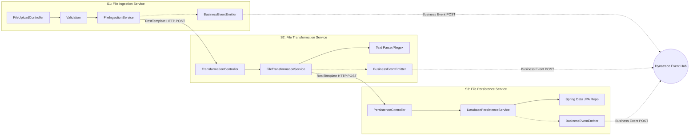

# 🚀 Final Project Presentation: Dynatrace Enterprise Pipeline Observability

## 1. Executive Summary
We successfully designed and implemented an enterprise-grade, highly observable, multi-stage file processing pipeline. By integrating **Dynatrace Business Events** directly into our Spring Boot microservices, we achieved real-time, end-to-end visibility of every single file flowing through the system. 

Furthermore, we implemented advanced **Idempotency and Auto-Versioning** logic, ensuring zero wasted compute and a perfectly clean observability dashboard even when users upload duplicate or modified files.

---

## 2. System Architecture (Low-Level Design)
The architecture consists of three synchronous microservices (Ingestion, Transformation, Persistence) communicating via REST and relying on PostgreSQL for state. Each service emits a standardized `bizevent` to Dynatrace upon completion or failure.

---

## 3. The Idempotency & Auto-Versioning Engine
To prevent duplicate files from polluting the Dynatrace dashboard and wasting compute cycles, we built a **Smart Idempotency Engine** powered by SHA-256 Content Hashing.

### How it works:
1. **Fingerprinting:** S1 immediately generates a SHA-256 hash of the incoming file bytes.
2. **Status Check:** S1 queries S3 to see if the file ID already exists in the database.
3. **Exact Duplicates:** If the ID and Hash match perfectly, S1 aborts the pipeline instantly. **Result:** Zero wasted compute and the Dynatrace DAG remains perfectly clean (no duplicate events emitted).
4. **Auto-Versioning (Modified Files):** If the ID matches but the Hash differs (the user edited the text document), S1 appends a timestamp to the ID (e.g., `fx-123` becomes `fx-123-v1724000000`). **Result:** Dynatrace treats this as a brand-new run, allowing the DAG to visualize the new attempt without overwriting the history of the original file!

---

## 4. The Dynatrace Enterprise Dashboard

The crown jewel of this project is the comprehensive Dynatrace Dashboard, featuring advanced DQL visualizations that we built from scratch.

### 4.1 Dashboard Overview & Pipeline DAG
Using complex `summarize` queries with `priority` weighting, we built a multi-hop Honeycomb DAG that traces the path of any individual file.

### 4.2 Live Error Feed & Aggregate Metrics
We implemented a real-time error drill-down table, allowing operations teams to see exactly why a file failed at a specific stage (e.g., `DUPLICATE_FILE` constraint violations).

### 4.3 Unified Table Tracker & Dedicated Heatmaps
We segmented pipeline health by Business Vertical (FX, EDM, ACCOUNTS). We built a Unified Color-Coded Table Tracker (Green/Red/Grey) and segmented Heatmaps mapping exactly 1 File (Y-axis) to exactly 3 Stages (X-axis).

*(Note: As documented, when running into visualization scaling issues on the honeycomb with multiple pipelines, you can reference `problem with honeycomb for file_pipeline for multiple.png` in the screenshots folder).*

---

## 5. Conclusion
This pipeline serves as a golden standard for microservice observability. Through intelligent Java logic (Idempotency) and advanced DQL capabilities, we provided the operations and management teams with a bulletproof, highly visual monitoring solution.
